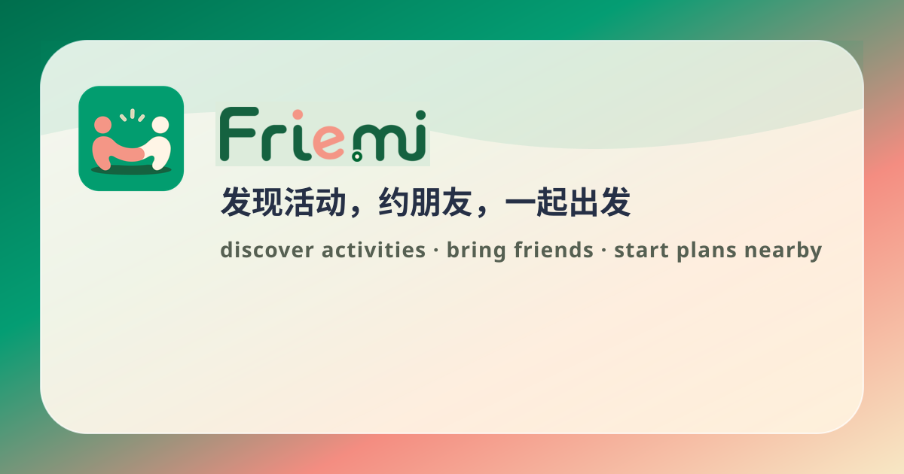
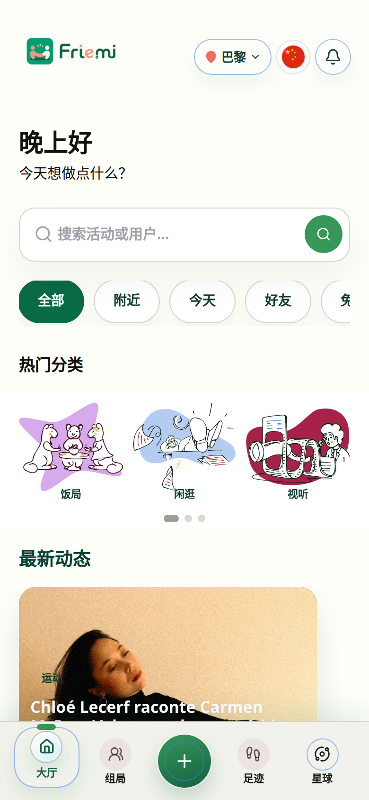
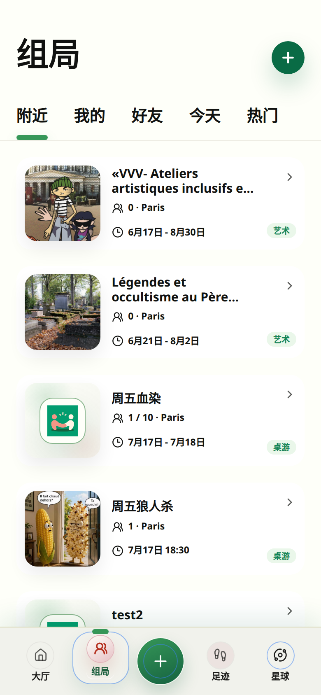
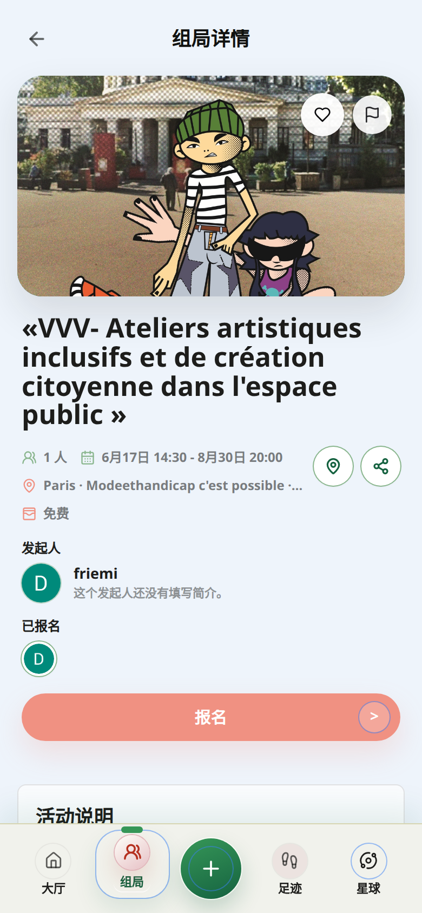
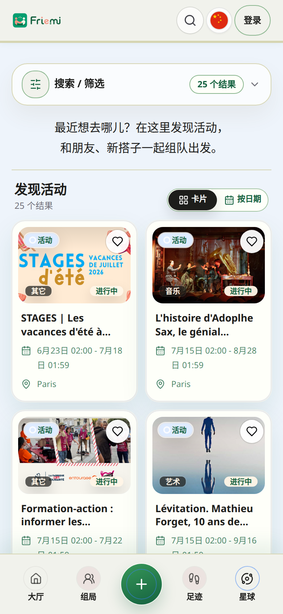
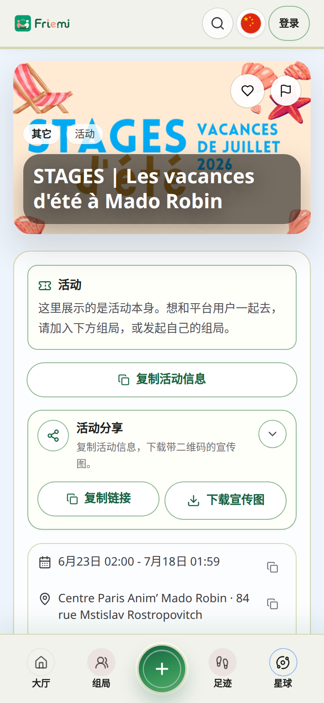
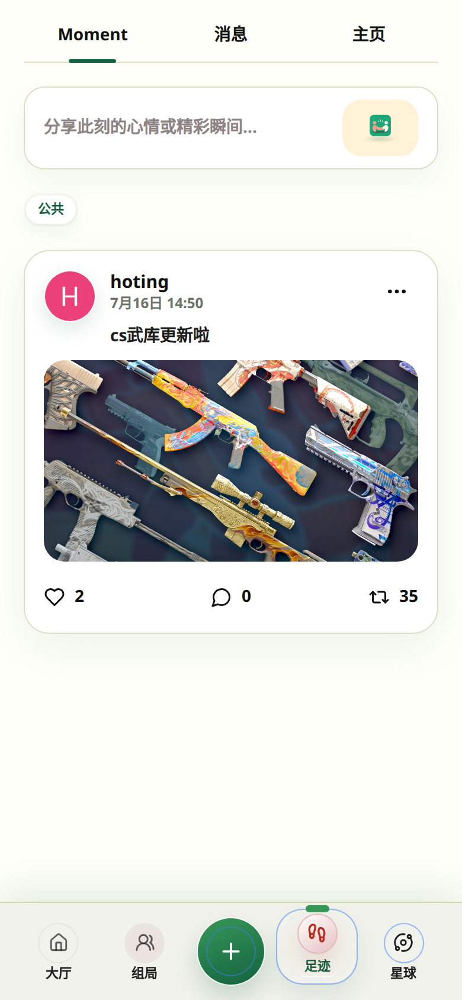
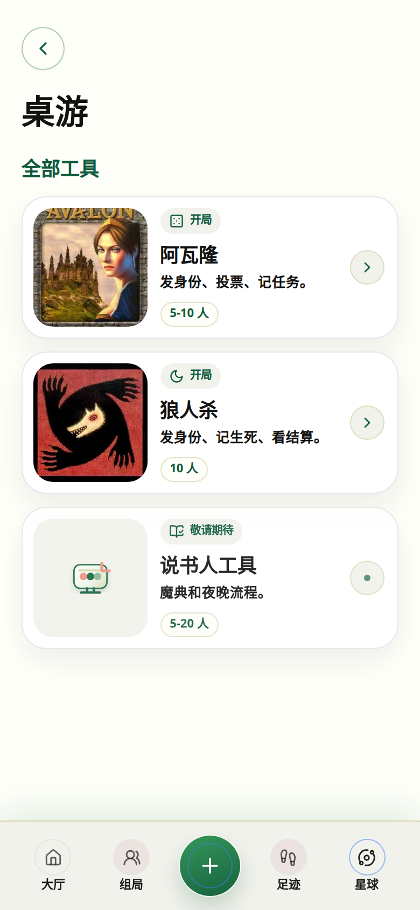

# Friemi

  

  <strong>在城市里发现活动，发起组局，留下足迹。</strong>

  <a href="https://www.friemi.com">官网</a>
  ·
  <a href="#产品一眼看懂">产品一眼看懂</a>
  ·
  <a href="#功能速览">功能速览</a>
  ·
  <a href="#体验入口">体验入口</a>

Friemi 是一个面向海外生活场景的活动发现与组局平台。你可以在这里发现城市活动，约朋友一起去，报名别人的计划，也可以用足迹记录一次见面、一场展、一顿饭或一段新关系。

当前首发城市是巴黎，支持中文、英文和法语。

## 产品一眼看懂

Friemi 围绕三件事展开：

| 发现 | 组局 | 沉淀 |
| --- | --- | --- |
| 看看这座城市今天有什么值得去 | 把一个想法变成可报名的计划 | 用足迹、消息和主页留下关系 |

## 从打开到出门

### 1. 先看看今天能做什么

<table>
  <tr>
    <td width="38%">
      
    </td>
    <td>
      
大厅是 Friemi 的第一屏。城市、搜索、热门分类和推荐内容都在这里，用户打开后不用先研究导航，就能直接找到今天的灵感。

      
适合快速浏览：饭局、展览、音乐、桌游、运动、旅行和朋友动态。

    </td>
  </tr>
</table>

### 2. 找一个有人一起去的组局

<table>
  <tr>
    <td>
      
组局页像一个轻量的“约人大厅”。你可以看附近、好友、今天和热门，也可以直接发起自己的计划。

      
每条组局都突出最重要的信息：图片、标题、人数、时间和类型。

    </td>
    <td width="38%">
      
    </td>
  </tr>
</table>

### 3. 进入详情，决定要不要报名

<table>
  <tr>
    <td width="38%">
      
    </td>
    <td>
      
详情页回答几个最真实的问题：这是什么局，谁发起，什么时候，在哪里，还有没有位置。

      
报名按钮、地图和分享入口都在移动端更靠前的位置，方便用户快速行动。

    </td>
  </tr>
</table>

### 4. 或者自己创建一个组局

不是所有活动都需要专业主办方。Friemi 让普通用户也能轻松发起一个计划：传封面、写标题、选类型、定时间地点、设置人数和费用，然后发布。

创建组局适合：

- 下班后桌游、饭局、展览同行
- 朋友间的小范围私密计划
- 从公开活动出发，约人一起去
- 需要审核报名的活动

### 5. 浏览城市里的公开活动

<table>
  <tr>
    <td width="38%">
      
    </td>
    <td>
      
活动页承接城市里的公开活动。你可以先发现活动，再选择自己去，或者发起一个组局邀请别人一起去。

      
它把“看到一个活动”和“真的有人一起去”接起来。

    </td>
  </tr>
</table>

### 6. 从活动详情进入下一步

<table>
  <tr>
    <td>
      
活动详情页展示图片、标题、时间、地点和外部链接。它不是只给信息，而是鼓励用户继续行动：查看详情、抢位置、收藏，或从这个活动发起组局。

    </td>
    <td width="38%">
      
    </td>
  </tr>
</table>

### 7. 用足迹记录和延续关系

<table>
  <tr>
    <td width="38%">
      
    </td>
    <td>
      
足迹是 Friemi 的轻社交空间。你可以发布图文 Moment，也可以在这里进入消息和个人主页。

      
活动结束后，Friemi 不只是留下一个报名记录，也可以留下朋友、评论和日常片段。

    </td>
  </tr>
</table>

### 8. 个人主页让关系可沉淀

主页会展示用户资料、好友码、发起组局、参与记录、收藏和好友关系。对于经常发起活动的人，它也是别人了解你风格和可信度的地方。

### 9. 线下桌游也能更顺

<table>
  <tr>
    <td>
      
桌游工具服务真实线下局，不替代玩家发言和主持。它负责开房、入座、发身份、看身份、公共屏和复盘，让现场少一点统计和传话。

      
当前包含 Avalon、狼人杀，并预留说书人工具。

    </td>
    <td width="38%">
      
    </td>
  </tr>
</table>

## 功能速览

| 场景 | Friemi 提供 |
| --- | --- |
| 发现活动 | 城市活动、分类、搜索、收藏、活动详情 |
| 发起组局 | 封面、时间地点、人数、费用、公开 / 私密、报名审核 |
| 报名参加 | 我要报名、取消报名、剩余名额、发起人信息、分享 |
| 好友消息 | 好友码、好友申请、私聊、图片消息、未读数 |
| 足迹动态 | 图文动态、点赞、评论、转发、举报、站内通知 |
| 个人空间 | 资料、发起、参与、收藏、好友关系 |
| 桌游工具 | 座位、身份、公共屏、死亡标记、结算和复盘 |
| 多语言 | 中文、英文、法语 |

## Web 与 App

Friemi 以 Web 为核心，同时适配移动浏览器、微信 WebView、Android WebView、iOS Safari 和桌面浏览器。App 端复用同一套产品能力，并补充系统通知、应用角标、登录回跳和安全区适配。

## 体验入口

- 官网：<https://www.friemi.com>
- 大厅：<https://www.friemi.com/zh-CN/mobile-home>
- 组局：<https://www.friemi.com/zh-CN/lobby>
- 活动：<https://www.friemi.com/zh-CN/activities>
- 足迹：<https://www.friemi.com/zh-CN/footprints>
- 桌游：<https://www.friemi.com/zh-CN/game-tools>

Friemi 会继续围绕移动端体验、活动质量、组局发布、足迹社交和线下工具打磨产品。
