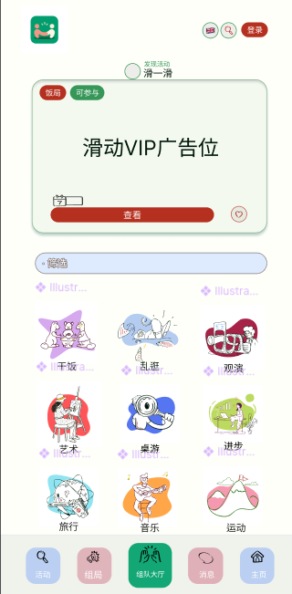

# Friemi

<p align="center">
  
</p>

<p align="center">
  <strong>把一次想出门，变成有人一起去的活动入口。</strong>
</p>

<p align="center">
  <a href="https://www.friemi.com">www.friemi.com</a>
  ·
  <a href="./docs/v2_2/implementation-checklist.md">v2.2 roadmap</a>
  ·
  <a href="./docs/v2_1/production-database-release-runbook.md">release runbook</a>
</p>

Friemi 是一个面向海外中文用户的活动发现、组局和线下社交工具。它不是单纯的活动列表，也不是只靠群聊接龙的报名表，而是把“发现活动、找人一起去、报名管理、好友关系、现场工具和复盘沉淀”放在同一个产品体验里。

当前首发市场是法国巴黎，产品支持中文、英文和法语。

## 产品定位

很多线下活动原本散落在微信群、小红书、Instagram、城市官网、朋友私聊和临时接龙里。Friemi 想解决的是一个更具体的问题：

```text
我想出门 -> 找到合适的活动 -> 看看有没有人一起去 -> 轻松报名 -> 活动后还能沉淀关系
```

Friemi 的核心人群：

- 想在海外找到活动和朋友的中文用户
- 经常发起饭局、展览、桌游、运动、city walk 的主理人
- 想把微信群里的临时小局变成可复用活动页面的组织者
- 需要中 / 英 / 法多语言活动信息的本地生活用户

## 核心体验

<table>
  <tr>
    <td width="42%">
      
    </td>
    <td>
      <h3>移动端大厅</h3>
      <p>把高频入口压缩在一屏里：活动推荐、搜索、我要组局、九宫格分类和底部导航。用户打开手机时先看到能做什么，而不是先读一大段说明。</p>
      <ul>
        <li>9+1 全局分类：饭局、闲逛、视听、艺术、桌游、进步、旅行、音乐、运动、其它</li>
        <li>冷门分类有补全策略，避免点进去只有空结果</li>
        <li>底部导航突出大厅，适合移动端重复使用</li>
      </ul>
    </td>
  </tr>
</table>

<table>
  <tr>
    <td>
      <h3>活动发现</h3>
      <p>从公开数据和站内组局中整理可参加内容，支持卡片视图、按日期视图、搜索、筛选、收藏和分享。</p>
      <ul>
        <li>公开活动导入后自动分类</li>
        <li>长期活动和单日活动按质量策略调配</li>
        <li>时间、地点、费用、天气、地图和订票信息集中展示</li>
      </ul>
    </td>
   
  </tr>
</table>

<table>
  <tr>
    <td width="42%">
      
    </td>
    <td>
      <h3>组局和共创主理人</h3>
      <p>用户可以把一个想法变成清晰的组局页面，邀请朋友一起参加。对于长期发起活动的人，Friemi 提供共创主理人身份展示和更专业的主页露出。</p>
      <ul>
        <li>登录报名、游客报名、报名审核和参与者头像</li>
        <li>分享链接、微信分享兜底、宣传海报下载</li>
        <li>他人主页只展示公开发起和已结束的参加记录，避免暴露正在参加或未来计划</li>
      </ul>
    </td>
  </tr>
</table>

## 当前产品能力

### 发现与搜索

- 活动大厅：公开活动、筛选、排序、卡片视图、日期视图
- 组局大厅：公开组局、分类筛选、滑动发现、我要组局
- 全局搜索：搜索活动、组局和用户
- 多语言：`zh-CN`、`en`、`fr`，活动内容支持翻译缓存

### 组局与报名

- 用户发起组局，支持时间、地点、人数、费用、封面、公开性和报名审核
- 游客可先报名，之后通过邮箱、电话或微信号绑定回正式账号
- 报名状态对用户可见，需审核的组局有明确提示
- 发起人和管理人可以管理报名、修改组局和取消组局

### 关系与消息

- 好友号、好友申请、私聊和通知中心
- 个人主页展示发起内容和已结束的参加记录
- 共创主理人身份在主页、头像弹窗和参与者信息中可见
- 关注 / 粉丝展示入口暂时隐藏，当前关系重点放在好友和活动参与

### 分享与传播

- Open Graph / 微信分享兜底
- 组局详情页海报生成和二维码
- 公开活动、组局和个人主页都可作为外部传播入口
- 没有微信公众号 JS-SDK 权限时，海报是更稳定的朋友圈替代方案

### 线下工具

Friemi 正在把“活动结束前后”的现场体验也放进产品。桌游组局报名后可以进入桌游工具入口。

<p>
  
</p>

- Avalon 阿瓦隆：开房、座位、发身份、投票、任务、复盘
- 狼人杀和血染钟楼：素材和入口已准备，后续逐步实现
- 工具目标：线下桌游少一点口头统计，多一点轻量好玩的现场辅助

## 技术栈

- Monorepo：Turborepo + npm workspaces
- Web：Next.js App Router + React 19 + TypeScript
- UI：Tailwind CSS + lucide-react + shared UI package
- Auth：Clerk
- Database：PostgreSQL + Prisma
- Storage：Supabase Storage
- I18n：next-intl
- Deploy：Vercel
- Tests：Node tests + Playwright site monitoring

## 项目结构

```text
friemi/
├── apps/
│   └── web/                 # Next.js Web 应用
├── packages/
│   ├── scraper-core         # 公共活动抓取与解析共享逻辑
│   ├── shared               # 共享类型、日期格式化等工具
│   └── ui                   # 基础 UI 组件
├── docs/                    # 版本清单、发布 runbook、设计说明
├── scripts/                 # 测试脚本与辅助工具
├── package.json
├── package-lock.json
└── turbo.json
```

## 本地开发

需要 Node.js `20.19+` 和 npm `10+`。

```bash
npm install
cp .env.example apps/web/.env.local
npm run db:generate
npm run dev
```

常用入口：

- 首页：`http://localhost:3000/zh-CN/home`
- 移动端大厅：`http://localhost:3000/zh-CN/mobile-home`
- 活动大厅：`http://localhost:3000/zh-CN/activities`
- 组局大厅：`http://localhost:3000/zh-CN/lobby`
- 更新公告：`http://localhost:3000/zh-CN/updates`
- 健康检查：`http://localhost:3000/api/health`

不要把真实密钥提交到 Git。环境变量参考根目录 `.env.example`。

## 数据库与 Prisma

Prisma schema 位于：

```text
apps/web/prisma/schema.prisma
```

常用命令：

```bash
npm run db:generate
npm run db:push
npm run db:migrate
npm run db:seed
```

结构变更优先通过 Prisma migration 或明确的 SQL runbook 管理。生产数据库不要直接执行 `prisma db push`。

## 公共活动导入

本地开发环境启动后，可以手动调用导入接口：

```bash
export LOCAL_URL="http://localhost:3000"
export CRON_SECRET="your-local-cron-secret"

curl -i -sS \
  -H "x-cron-secret: ${CRON_SECRET}" \
  "${LOCAL_URL}/api/cron/import-public-activities?limit=50"

unset LOCAL_URL
unset CRON_SECRET
```

预览或生产环境把 `LOCAL_URL` 换成对应 HTTPS 域名。先小批量确认日志和数据结果，再扩大导入量。

## 质量检查

```bash
npm run typecheck
npm run test
```

Playwright 站点监控：

```bash
PLAYWRIGHT_MONITOR_BASE_URL="https://your-preview-url.vercel.app/zh-CN/home" \
PLAYWRIGHT_MONITOR_WORKERS=1 \
PLAYWRIGHT_MONITOR_MAX_LOAD_MS=15000 \
npm run monitor:site --workspace=apps/web
```

## 发布前检查

- `npm run typecheck` 通过
- Prisma schema 已同步到目标数据库
- Vercel 环境变量和目标数据库一致
- `NEXT_PUBLIC_APP_URL` 指向正确的 Preview 或 Production 域名
- 公开活动导入、天气、翻译、分享卡片失败时不影响主页面浏览
- 预览环境跑过核心页面 smoke / monitoring

## 版本文档

- v2.2 实现清单：`docs/v2_2/implementation-checklist.md`
- v2.1 发布数据库 runbook：`docs/v2_1/production-database-release-runbook.md`
- v2.1 首页规划：`docs/v2_1/home-luxury-co-creators-layout-plan.md`
- v2.1 品牌风格计划：`docs/v2_1/brand-style-overhaul-plan.md`
- v2.0 实现清单：`docs/v2_0/implementation-checklist.md`

更多历史文档位于 `docs/v1_0` 到 `docs/v1_4`。
