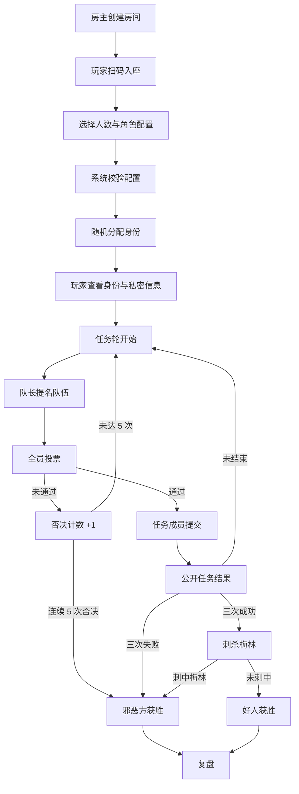

# 阿瓦隆线下辅助工具设计规划书

> 文档版本：v0.1
> 生成日期：2026-06-30
> 适用阶段：产品立项、MVP 范围确认、研发拆解
> 产品形态：Web / PWA 优先，面向线下玩家的局内辅助工具
> 说明：本文是产品与技术规划，不构成法律意见。正式上线前请确认游戏名称、角色名称、规则文本、图片素材、商标与商业用途的授权边界。

---

## 0. v0.1 落地状态

当前分支已完成一个可打开、可线下试玩的 v0.1 前端原型。

访问路径：

```text
/{locale}/game-tools/avalon
```

示例：

```text
/zh-CN/game-tools/avalon
/en/game-tools/avalon
/fr/game-tools/avalon
```

v0.1 已包含：

- [x] Friemi 风格原创 Avalon 素材包，不使用官方牌面、Logo 或官方角色插画
- [x] 流程向导式 UI：开局、发身份、选队伍、任务结果、刺杀、复盘分步展示，避免把所有控制一次性堆在同一页
- [x] 5-10 人人数切换
- [x] 常用身份配置与随机发身份预览
- [x] 圆桌座位图与座位选择
- [x] 身份防窥卡背与身份揭示预览
- [x] 五轮任务板、任务人数提示、队长顺移
- [x] 队伍选择人数校验
- [x] 任务成功 / 失败记录，含 7 人及以上第四轮两张失败规则
- [x] 连续否决计数与五次否决胜负结算
- [x] 三次成功后的刺杀阶段入口
- [x] 三次失败 / 刺杀命中 / 刺杀失败的胜负结算
- [x] 本局复盘时间线
- [x] 中 / 英 / 法基础文案

v0.1 暂不包含：

- [x] 多人房间基础：创建房间、房号入口、座位认领
- [x] 数据库持久化：房间、座位、房间事件和身份私密 payload
- [x] 玩家各自手机的私密身份隔离：每个座位生成独立私密链接，默认防窥
- [ ] 实时投票提交与匿名任务提交
- [ ] 房主撤销 / 修正审计日志
- [ ] 复盘图片导出
- [ ] 音效、计时器和公共屏

结论：v0.1 适合用于验证 UI、流程、素材风格和线下主持体验，不适合作为正式多人房间上线版本。

## 0.1 v0.2 落地状态

当前分支开始进入 v0.2：多人房间基础。

新增访问路径：

```text
/{locale}/game-tools/avalon
/{locale}/game-tools/avalon/rooms/{roomId}
/{locale}/game-tools/avalon/join/{code}
/{locale}/game-tools/avalon/seats/{privateToken}
```

v0.2 已覆盖：

- [x] 房主创建 Avalon 房间，选择人数、模式和房间名
- [x] 创建时自动生成全部座位，支持 5-10 人
- [x] 每个房间生成短房号，玩家可通过房号链接进入
- [x] 玩家可认领空座位，未登录用户可用桌上昵称认领
- [x] 每个座位生成独立私密身份链接
- [x] 房主开局后随机分配身份，身份写入各自私密链接
- [x] 私密身份页默认防窥，玩家主动点击后才显示身份
- [x] 星眼智者、双星守望、暗潮成员的可见信息按角色降级展示
- [x] 房间事件记录：创建、认领座位、开局
- [x] v0.2 视觉精修：房间大厅使用圆桌座位图，座位和身份优先用 token / 角色牌图形表达，减少说明文字
- [x] 私密身份页使用卡背防窥和角色牌主视觉，让玩家更像在看自己的身份牌

v0.2 仍不包含：

- [ ] WebSocket / 实时同步，当前依赖页面刷新和 server action revalidate
- [x] 队长提名、全员投票和匿名任务提交
- [ ] 房主撤销身份、重新发牌、踢出座位和强制换座
- [ ] 二维码生成与扫码加入的完整体验
- [ ] 公共屏模式
- [ ] 赛后复盘导出

结论：v0.2 是“能在线下开一个持久化数字身份房间”的基础版本，适合验证扫码 / 私密身份 / 房主开局体验；完整局内自动化应进入 v0.3。

## 0.2 v0.3 落地状态

当前分支已继续补齐 v0.3 局内回合闭环。

v0.3 已覆盖：

- [x] 房主 / 主持人在房间页选择本轮任务队伍
- [x] 系统校验每轮任务所需人数
- [x] 玩家在私密身份页提交队伍赞成 / 反对票
- [x] 全员投票完成后自动判断队伍是否通过
- [x] 队伍未通过时推进否决计数，五次连续否决自动判暗潮方获胜
- [x] 队伍通过后，任务成员在私密身份页提交任务牌
- [x] 圆桌阵营不能提交失败牌，暗潮阵营可提交成功或失败
- [x] 系统按失败牌数量和 7 人及以上第四轮双失败规则结算任务
- [x] 三次任务失败自动判暗潮方获胜
- [x] 三次任务成功进入刺杀阶段
- [x] 刺客在私密身份页选择刺杀目标
- [x] 刺中星眼智者判暗潮方胜利，未刺中判圆桌方胜利
- [x] 房间页任务板展示五轮任务 token、当前队伍、投票 / 任务提交进度和胜负图形
- [x] 私密页动作使用投票牌、任务 token 和座位 token，减少说明文字
- [x] v0.3 图形化精修：房间页更像任务台，私密页更像玩家手牌；投票、任务和刺杀动作都以大图卡作为主要交互

v0.3 仍不包含：

- [ ] WebSocket / 实时同步，当前仍依赖提交后刷新页面
- [ ] 队长玩家本人操作权限绑定，当前由房主 / 主持人在公共房间页提名队伍
- [ ] 任务提交洗牌动画和延迟揭晓
- [ ] 房主撤销 / 修正某轮结果
- [ ] 二维码生成与扫码加入
- [ ] 公共屏观战模式

结论：v0.3 已经具备“线下数字身份 + 私密投票 / 任务 + 自动胜负结算”的可试玩闭环。下一步应优先补实时同步、二维码和房主修正能力。

## 0.3 v0.4 落地状态

当前分支继续补齐 v0.4 现场使用能力，重点是降低线下操作摩擦，而不是新增规则复杂度。

新增访问路径：

```text
/{locale}/game-tools/avalon/rooms/{roomId}/screen
```

v0.4 已覆盖：

- [x] 房间页展示扫码入座二维码，玩家无需手动输入房号
- [x] 公共屏页面展示房号、二维码、座位、任务 token、投票进度、任务牌进度和胜负图形
- [x] 公共屏不展示全部身份、私密链接或角色信息，只展示可公开信息
- [x] 房间页、公共屏和私密身份页接入轻量自动刷新，线下玩家提交后其他设备可更快看到状态变化
- [x] 公共屏视觉以大号任务 token、座位 token 和阶段图片为主，适合投屏或平板摆桌面
- [x] v0.4 图形化精修：公共屏统计改成图标数字牌，当前阶段改成中央大牌，私密页可见信息改成角色 / 座位 token 网格

v0.4 仍不包含：

- [ ] WebSocket / Supabase Realtime 级别的真正实时同步
- [ ] 房主撤销 / 修正某轮结果
- [ ] 任务提交洗牌动画和延迟揭晓
- [ ] 复盘图片导出
- [ ] 音效、倒计时和主持语音提示

结论：v0.4 已经适合小范围线下试玩：玩家扫码入座，用私密页操作，桌面或投屏打开公共屏看进度。后续应优先补房主修正能力和真正实时通道。

## 0.4 v0.5 落地状态

当前分支继续补齐 v0.5 主持人修正和现场反馈能力。

v0.5 已覆盖：

- [x] 房主修正面板：支持重置当前轮，清理当前轮投票 / 任务提交，并回到提队阶段
- [x] 房主撤回上一轮任务结果：清理上一轮任务提交，撤回胜负推进，回到该轮提队阶段
- [x] 修正动作写入 `GameToolEvent`，作为轻量审计日志
- [x] 房间页增加事件 token 轨道，展示最近关键事件
- [x] 公共屏增加事件 token 轨道，让投屏可以快速看到刚发生的节点
- [x] 任务成功 / 失败 token 增加轻量揭晓动效，增强线下反馈
- [x] v0.5 图形化精修：修正按钮改成大图牌，事件 token 增加回合角标和座位点，降低现场阅读成本
- [x] v0.5 素材补强：补充扫码加入、公共屏、实时同步、重置回合、撤回任务、开始 / 组队 / 修正事件节点等原创 SVG token，并接入房间页和公共屏
- [x] v0.5 UI 舒适度优化：房间页增加当前阶段提示牌，控制面板标题随阶段变化，任务板、事件轨道、私密操作页和公共屏阶段牌进一步图形化
- [x] 组局详情接入口：桌游分类组局在用户报名后展示桌游工具悬浮入口，第一项跳转 Avalon 工具

v0.5 仍不包含：

- [ ] 逐条恢复 / 回滚任意历史节点
- [ ] 更细的主持人审计筛选和导出
- [ ] 复盘图片导出
- [ ] 真正实时通道，当前仍是轻量定时刷新
- [ ] 音效和任务牌洗牌延迟揭晓

结论：v0.5 让线下试玩更可控：主持人误点或玩家误交后，可以快速把局面拉回可继续玩的状态，并让所有人通过公共屏看到修正发生。

## 0.5 v0.6 落地状态：玩家局内操作 HUD

当前分支继续优化玩家手机端局内体验，重点是让手机只围绕“当前局、当前轮、当前操作”服务，减少线下玩家阅读负担。

v0.6 已覆盖：

- [x] 私密玩家页默认选中当前轮；已经过的轮次可以点击回看
- [x] 过往轮次展示任务结果、自己的投票 / 任务提交，以及该轮投票和任务牌数量摘要
- [x] 当前轮操作优先展示在身份卡前面，玩家打开页面先看到自己是否需要行动
- [x] 投票、任务牌、刺杀和等待状态继续使用大图形按钮 / token，不把说明文字铺满页面
- [x] 身份信息改成局内口袋式面板：保留防窥揭示，但不抢占当前操作区域
- [x] 新增轻量 `?` 玩法提示弹窗，必要时解释轮次切换和亮起按钮，不在主界面堆说明文字

v0.6 仍不包含：

- [ ] 任意历史节点恢复 / 回滚
- [ ] 完整投票矩阵导出
- [ ] 队长玩家直接在自己手机提名队伍

结论：v0.6 让玩家手机端更像局内操作器，而不是说明书页面。默认看当前轮，必要时再回看过往轮次，适合移动端现场使用。

## 0.6.1 v0.1-v0.6 未覆盖能力与 v1 优先级规划

下面只盘点 v0.1 到 v0.6 曾经明确“不包含”、且截至 v0.6 仍未完整解决的能力。已经在 v0.2-v0.6 补齐的多人房间、私密身份、投票、任务提交、二维码、公共屏、房主修正和玩家轮次回看不再重复列入。

### v1 必须做：P0

| 能力 | 当前缺口 | v1 处理建议 | 原因 |
| --- | --- | --- | --- |
| 稳定实时同步 | 当前是轻量自动刷新，不是真正实时通道 | v1 至少接入 Supabase Realtime / Server-Sent Events / 更稳定的短轮询策略之一，并补提交中、已同步、同步失败状态 | 线下多人同时操作时，状态延迟会直接影响游戏节奏 |
| 队长玩家手机提名队伍 | 当前由房主 / 主持人在房间页提名队伍 | v1 让当前队长的私密页出现“选队伍”操作，房主保留代操作入口 | 这会让工具更贴近真实桌游流程，而不是主持人替所有人操作 |
| 开局前座位管理 | 仍缺踢出座位、强制换座、释放座位、重新发私密链接 | v1 在房主面板加入开局前座位管理；开局后只允许谨慎修正 | 线下局经常有人扫码错座、换座、临时退出 |
| 重新发牌 / 重开本局 | 当前已有重置当前轮和撤回上一轮任务，但不覆盖身份误发、身份泄露 | v1 增加“重新发身份 / 重开本局”二次确认，写入事件日志 | 身份类游戏最常见事故是身份泄露或开局配置错误 |
| 防重复提交与同步反馈 | 已有唯一约束，但玩家端反馈仍偏轻 | v1 在私密页明确显示“已提交 / 等 X 人 / 可否修改”，并避免误以为按钮无效 | 玩家需要立刻知道自己点成功了没有 |
| 局内错误恢复说明 | 当前修正能力存在，但现场决策依赖主持人理解 | v1 把常见事故做成图形化恢复入口：误投票、误交任务、身份泄露、玩家掉线 | 降低主持人临场压力 |

### v1 建议做：P1

| 能力 | 当前缺口 | v1 处理建议 | 原因 |
| --- | --- | --- | --- |
| 任务提交洗牌动画与延迟揭晓 | 目前有 token 揭晓动效，但没有“洗牌 / 等待揭晓”的仪式感 | v1 做轻量动画：任务牌收集完成后先合拢洗牌，再揭示结果 | 更像线下实体牌体验，也减少玩家猜提交顺序 |
| 倒计时 / 发言计时器 | v0.1-v0.6 未接入计时器 | v1 做可选计时器，不强制进入规则流程 | 有助于控场，但不能打断线下讨论 |
| 完整投票矩阵 | 当前过往轮次能看摘要，不是完整矩阵 | v1 房间页 / 复盘页展示玩家 × 轮次投票表，可折叠 | 复盘时非常有价值，但局内不应过度占屏 |
| 复盘页基础版 | 当前有事件轨道和轮次回看，但没有独立复盘页 | v1 做一个轻量复盘页：任务结果、投票矩阵、关键事件、胜负原因 | 一局结束后能自然沉淀和分享 |
| 公共屏细节优化 | 已有公共屏，但仍可加强可读性和大屏节奏 | v1 优化大屏阶段切换、等待人数、任务揭示动画 | 桌面 / 投屏体验是线下工具的核心价值之一 |
| 断线重连体验 | 有私密链接，但缺显式重连状态 | v1 增加“回到我的座位 / 私密链接丢失处理 / 重新复制身份链接” | 现场手机刷新、锁屏、断网很常见 |

### v1 可选做：P2

| 能力 | 当前缺口 | 处理建议 | 原因 |
| --- | --- | --- | --- |
| 复盘图片导出 | 多个版本都列为未包含 | v1 可做简单长图，复杂海报延后 | 有传播价值，但不影响局内能不能玩 |
| 音效 | v0.4-v0.5 未接入 | 仅做关闭默认的轻提示音，或延后 | 线下场景容易打扰别人，必须谨慎 |
| 主持人审计筛选 / 导出 | 当前只有事件记录 | v1 可不做导出，只保留事件轨道 | 只有重度局或争议局才需要 |
| 任意历史节点恢复 | 当前只能重置当前轮、撤回上一轮任务 | 延后到 v1.1+，不要在 v1 做复杂回滚 | 任意回滚风险高，容易把状态机做复杂 |
| 房规配置 | 当前按标准规则 | v1 可先不做，只保留标准规则 | 自定义规则会增加 UI 和校验复杂度 |
| 自定义角色 / 自定义任务人数 | 当前使用常见配置 | 延后 | 适合高阶玩家，但不适合第一版正式体验 |

### v1 不建议做

| 能力 | 建议 | 理由 |
| --- | --- | --- |
| 不同游戏之间的房间迁移 | 不做 | Avalon 房间和说书人工具房间状态结构不同，迁移价值低且容易出错 |
| 说书人工具正式完整房间 | 不放进 Avalon v1 | 说书人工具可以共用平台底座，但应作为独立里程碑推进 |
| 完整通用房间管理后台 | 不放进 Avalon v1 | 当前先把 Avalon 现场体验打磨好，后台抽象可以等第二个游戏真正接入后再固化 |
| 复杂战绩、胜率、成就统计 | 不放进 Avalon v1 | 会把线下娱乐工具推向竞技化，和“轻巧辅助”目标冲突 |
| 策略建议 / AI 推理提示 | 不做 | 会破坏社交推理游戏本身，也容易引发公平性问题 |

### v1 推荐切分

```text
v1.0-alpha：同步稳定 + 队长提名 + 开局前座位管理
v1.0-beta：重开 / 重新发牌 + 防重复提交反馈 + 断线重连
v1.0-rc：任务洗牌揭晓 + 基础复盘页 + 公共屏细节优化
v1.1+：复盘长图、音效、任意历史回滚、高阶房规
```

v1 的核心判断标准：线下 5-10 人真实开一局时，玩家不需要读说明，也不需要主持人反复解释手机怎么用；出错后能恢复，结束后能复盘。凡是不服务这个目标的能力，都可以延后。

## 0.6 v1.0 落地状态：多游戏统一房间系统

当前分支开始进入 v1.0：把 Avalon 已验证的房间能力抽成平台层，避免后续说书人工具、狼人杀等工具重复造轮子。

v1.0 已覆盖：

- [x] 新增统一桌游工具大厅 `/game-tools`，集中展示 Avalon 与说书人工具入口
- [x] 新增说书人工具预览页 `/game-tools/storyteller`，说明共用房间、私密魔典和公共屏的产品边界
- [x] 抽出 `gameToolRooms.ts`：统一生成短房号、私密 token、默认座位名和房间 revalidate
- [x] 抽出 `gameToolCatalog.ts`：统一维护游戏工具标题、人数、入口、状态和展示素材
- [x] Prisma `GameToolKind` 预留 `STORYTELLER`，让说书人工具可以接入同一套 `GameToolRoom / Seat / Event / Submission` 模型
- [x] Avalon 创建房间时显式写入 `kind=AVALON`
- [x] Avalon 查询和 action 增加 `kind=AVALON` 边界，避免未来说书人工具房间被 Avalon 路由误处理

v1.0 仍不包含：

- [ ] 说书人工具正式创建房间
- [ ] 通用房间管理后台
- [ ] 不同游戏之间的房间迁移
- [ ] 通用公共屏组件抽象
- [ ] 通用玩家入座组件抽象

结论：v1.0 不是“把所有游戏一次做完”，而是把房间底座稳定下来。Avalon 继续作为第一个完整游戏，说书人工具后续可以在同一套平台能力上继续接入魔典、夜晚流程和公共屏。

---

## 1. 项目背景

阿瓦隆是一款 5–10 人、约 30 分钟的隐藏身份社交推理游戏。线下游玩时，玩家围绕队伍提名、公开投票、匿名任务结果、梅林隐藏身份和刺客最终刺杀展开博弈。官方发行方页面描述其核心为善恶阵营对抗：邪恶方彼此知情并隐藏在好人中，梅林知道邪恶方但必须隐藏自己；游戏支持 5–10 人，时长约 30 分钟。

本工具定位为“线下辅助工具”，不替代实体桌游，也不让玩家长时间盯手机。核心价值是降低开局、投票、任务记录、规则校验与复盘成本。

### 1.1 产品目标

| 目标 | 说明 |
|---|---|
| 快速开局 | 自动按人数生成合法配置，减少主持或房主查规则的时间 |
| 规则防错 | 自动提示任务人数、队长轮转、连续否决、任务成败与刺杀流程 |
| 隐私保护 | 身份、阵营互认、任务提交选择等信息严格隔离 |
| 线下低干扰 | 玩家主要进行面对面发言，手机只在身份确认、投票、任务提交时使用 |
| 可复盘 | 记录每轮队伍、投票、任务结果和最终刺杀，便于赛后讨论 |
| 可扩展 | 后续支持房规、变体角色、桌游店活动和社群统计 |

### 1.2 非目标

第一版不做以下内容：

- 不做 AI 阵营概率判断。
- 不做自动策略推荐。
- 不做复杂排行榜和强竞技积分。
- 不复制官方说明书长篇规则原文或官方美术资源。
- 不强制所有玩家注册账号。
- 不让工具替代玩家发言、欺骗、推理和社交互动。

---

## 2. 用户与使用场景

### 2.1 用户角色

| 用户角色 | 核心诉求 | 典型设备 |
|---|---|---|
| 房主 | 快速建局、配置角色、处理误操作、结算复盘 | 手机 / 平板 |
| 玩家 | 查看自己身份、投票、提交任务卡、查看公共进度 | 手机 |
| 公共屏观众 | 只看任务进度、队长、队伍、投票和结算 | 投屏 / 大屏 |
| 桌游店主持 | 多局快速开桌、减少规则解释和记录成本 | 平板 / 电脑 |
| 复盘参与者 | 查看完整身份、投票矩阵和关键节点 | 手机 / 大屏 |

### 2.2 核心线下场景

| 场景 | 描述 | 工具价值 |
|---|---|---|
| 熟人局 | 玩家熟悉规则，但容易忘记任务人数和特殊轮次 | 自动记录与规则提醒 |
| 新手局 | 新玩家不熟悉闭眼流程和胜负条件 | 流程引导与提示 |
| 桌游店局 | 多桌并发，主持人需要高效管理 | 快速建局、可投屏、可复盘 |
| 无实体牌局 | 临时局缺少身份牌或任务牌 | 数字身份、数字任务提交 |
| 复盘局 | 玩家想回看谁投了什么队、哪轮出失败 | 时间线和投票矩阵 |

---

## 3. 使用模式设计

建议第一版支持三种模式，按复杂度递增。

| 模式 | 适用场景 | 玩家手机参与度 | 说明 |
|---|---|---:|---|
| 公共辅助模式 | 使用实体身份牌和任务牌 | 低 | 工具只记录队伍、投票、任务结果、胜负 |
| 数字身份模式 | 无实体牌或想快速开局 | 中 | 系统发身份，玩家手机查看身份与私密信息 |
| 全数字操作模式 | 希望无纸化 | 高 | 玩家在线投票和提交任务结果，系统自动结算 |

MVP 建议优先实现“数字身份模式 + 关键操作数字化”，这样可以验证房间、扫码、权限、实时同步、匿名提交和复盘能力。

---

## 4. 核心流程

### 4.1 总流程



### 4.2 开局流程

1. 房主进入平台，选择“阿瓦隆辅助”。
2. 房主选择使用模式：公共辅助 / 数字身份 / 全数字操作。
3. 房主设置人数，或让玩家扫码加入后自动统计人数。
4. 玩家选择座位，系统生成顺时针顺序。
5. 房主选择角色配置：基础配置、常用配置、自定义配置。
6. 系统校验人数、阵营比例、特殊角色依赖关系。
7. 房主确认后，系统随机分配身份。
8. 玩家通过个人页面查看身份。
9. 系统展示闭眼确认流程，进入第一轮任务。

### 4.3 身份确认流程

工具应支持两种身份确认方式：

| 方式 | 说明 |
|---|---|
| 主持文字提示 | 单设备或投屏显示“所有人闭眼”“邪恶方确认”等流程，由房主念出 |
| 玩家私密页面 | 玩家手机显示自己的身份、阵营、可见信息，避免全体闭眼流程耗时过长 |

隐私交互要求：

- 玩家查看身份前需长按或滑动确认。
- 身份页面默认模糊，防止手机放桌上时被他人看到。
- 离开身份页后需要再次确认才可显示。
- 房主不可在公共屏展示任意玩家身份。
- 游戏结束前，不提供“一键查看所有身份”的公共入口。

### 4.4 任务轮流程

每轮任务由队长提名队伍，全员投票决定是否通过。若队伍通过，任务成员匿名提交成功/失败，系统只公布任务结果和失败数量。

#### 4.4.1 队长提名

- 系统显示当前队长、轮次、任务所需人数。
- 队长在玩家列表中选择任务成员。
- 系统校验任务人数是否正确。
- 队长确认后进入投票。
- 房主可撤销提名，回到队长选择页面。

#### 4.4.2 全员投票

- 所有玩家提交“赞成 / 反对”。
- 所有玩家提交前，任何人不可查看中间结果。
- 投票结束后公开每位玩家的选择。
- 简单多数通过；平票视为未通过。
- 未通过时，否决计数 +1，队长顺移。
- 连续五次队伍被否决时，系统进入邪恶方胜利结算。

#### 4.4.3 任务提交

- 只有任务成员进入任务提交页。
- 好人默认只能提交成功；如需兼容房规，可由房主打开“允许所有人选择”开关。
- 邪恶方可选择成功或失败。
- 提交顺序不进入公共记录。
- 公开结果只展示：任务成功/失败、失败牌数量。
- 在 7 人及以上的第四个任务中，系统提醒“该轮需要至少两张失败才算任务失败”。

### 4.5 刺杀梅林流程

当好人完成三次成功任务后，进入刺杀阶段。

1. 系统冻结任务板。
2. 邪恶方进入最终讨论，可启用倒计时。
3. 刺客或房主提交刺杀对象。
4. 系统判断是否命中梅林。
5. 命中则邪恶方获胜，未命中则好人获胜。
6. 系统进入全身份揭示和复盘页面。

---

## 5. 页面与信息架构

| 页面 | 使用者 | 核心内容 |
|---|---|---|
| 游戏选择页 | 房主 | 选择阿瓦隆辅助工具 |
| 创建房间页 | 房主 | 模式、人数、角色配置、房规开关 |
| 房间大厅 | 全员 | 二维码、座位、玩家准备状态 |
| 身份页 | 玩家 | 自己的身份、阵营、可见信息 |
| 公共任务板 | 全员 / 投屏 | 任务轮次、成功/失败、队长、否决次数 |
| 队长提名页 | 当前队长 | 选择任务成员 |
| 投票页 | 全员 | 赞成 / 反对 |
| 任务提交页 | 任务成员 | 成功 / 失败提交 |
| 刺杀页 | 刺客 / 房主 | 选择梅林候选 |
| 结算页 | 全员 | 胜负、原因、身份揭示 |
| 复盘页 | 全员 | 时间线、投票矩阵、任务详情 |
| 房主控制台 | 房主 | 撤销、修正、踢人、断线处理 |

---

## 6. 权限与可见性

| 信息 / 操作 | 房主 | 当前玩家 | 其他玩家 | 公共屏 |
|---|---:|---:|---:|---:|
| 房间配置 | 可见/可改 | 可见 | 可见 | 可见 |
| 座位顺序 | 可见/可改 | 可见 | 可见 | 可见 |
| 自己身份 | 可见，默认隐藏入口 | 可见 | 不可见 | 不可见 |
| 他人身份 | 游戏中不可公开查看 | 不可见 | 不可见 | 不可见 |
| 阵营互认信息 | 不在公共屏展示 | 按角色可见 | 不可见 | 不可见 |
| 队长提名 | 可见/可撤销 | 可见 | 可见 | 可见 |
| 投票中间结果 | 不可见或仅提交状态 | 不可见 | 不可见 | 不可见 |
| 投票最终结果 | 可见 | 可见 | 可见 | 可见 |
| 任务提交选择 | 不记录到公共视图 | 仅自己知道 | 不可见 | 不可见 |
| 任务失败数量 | 可见 | 可见 | 可见 | 可见 |
| 复盘身份 | 游戏结束后可见 | 游戏结束后可见 | 游戏结束后可见 | 可按设置展示 |

---

## 7. 功能模块

### 7.1 P0：MVP 必须实现

| 模块 | 功能 | 说明 |
|---|---|---|
| 房间系统 | 创建房间、加入房间、二维码、断线重连 | 不强制注册 |
| 座位系统 | 座位排序、换座、准备状态 | 队长按座位顺序轮转 |
| 配置系统 | 人数、角色、任务人数、房规开关 | 配置不合法时阻止开局 |
| 身份系统 | 随机发身份、私密查看、重新发放 | 支持防窥遮罩 |
| 队长系统 | 自动轮转、手动调整 | 异常时房主可修正 |
| 提名系统 | 队长选择任务成员 | 自动校验人数 |
| 投票系统 | 全员赞成/反对、公开结果 | 提交前隐藏中间结果 |
| 任务系统 | 任务成员匿名提交 | 只公开失败数量 |
| 结算系统 | 三成功、三失败、五否决、刺杀梅林 | 自动判断胜负原因 |
| 复盘系统 | 身份揭示、轮次时间线 | 至少支持局内查看 |

### 7.2 P1：增强体验

| 模块 | 功能 | 说明 |
|---|---|---|
| 公共屏 | 投屏任务板 | 适合桌游店和多人局 |
| 闭眼引导 | 大字提示、可选语音 | 新手友好 |
| 计时器 | 发言计时、刺杀讨论计时 | 可暂停/延长 |
| 投票矩阵 | 玩家 × 轮次投票表 | 强化复盘 |
| 导出图片 | 复盘长图 | 社群分享 |
| 手动修正 | 房主修改投票、任务、队长 | 防误触 |
| 房规配置 | 第五轮自动通过、好人可误交失败等 | 需明确标记为房规 |

### 7.3 P2：长期能力

| 模块 | 功能 | 说明 |
|---|---|---|
| 自定义角色 | 自定义角色名、阵营、可见信息 | 避免依赖官方素材 |
| 统计系统 | 玩家胜率、阵营胜率、角色胜率 | 默认弱化竞技感 |
| 活动系统 | 桌游店开桌、报名、排队 | 平台化运营 |
| 多语言 | 中文、英文等 | 支持跨地区社群 |
| 观战复盘 | 赛后匿名分享链接 | 默认关闭私密信息 |

---

## 8. 规则配置建议

### 8.1 任务人数表

系统内置 5–10 人任务人数表，并在 UI 中展示当前轮所需人数。建议以可配置数据驱动，便于兼容房规。

```json
{
  "5": [2, 3, 2, 3, 3],
  "6": [2, 3, 4, 3, 4],
  "7": [2, 3, 3, 4, 4],
  "8": [3, 4, 4, 5, 5],
  "9": [3, 4, 4, 5, 5],
  "10": [3, 4, 4, 5, 5]
}
```

### 8.2 特殊校验

| 规则点 | 系统行为 |
|---|---|
| 5–10 人 | 超出范围禁止使用标准规则开局 |
| 平票 | 队伍未通过 |
| 连续五次否决 | 邪恶方获胜 |
| 任务失败条件 | 通常一张失败即失败 |
| 7 人及以上第四任务 | 至少两张失败才失败 |
| 三次任务失败 | 邪恶方获胜 |
| 三次任务成功 | 进入刺杀梅林阶段 |
| 刺杀梅林命中 | 邪恶方获胜 |
| 刺杀梅林未命中 | 好人方获胜 |

---

## 9. 数据模型草案

### 9.1 核心实体

```ts
type GameStatus =
  | "lobby"
  | "identity_reveal"
  | "team_building"
  | "team_voting"
  | "quest_submission"
  | "assassination"
  | "finished";

type AvalonMode = "public_assist" | "digital_identity" | "full_digital";

type Alignment = "good" | "evil";

type VoteChoice = "approve" | "reject";

type QuestCard = "success" | "fail";

interface GameSession {
  id: string;
  gameType: "avalon";
  mode: AvalonMode;
  status: GameStatus;
  playerCount: number;
  hostPlayerId: string;
  currentRoundIndex: number;
  currentLeaderSeatIndex: number;
  createdAt: string;
  endedAt?: string;
}

interface Player {
  id: string;
  sessionId: string;
  seatIndex: number;
  nickname: string;
  avatarUrl?: string;
  connectionStatus: "online" | "offline";
  isReady: boolean;
}

interface AvalonConfig {
  sessionId: string;
  roleKeys: string[];
  questTeamSizes: number[];
  evilCount: number;
  useLadyOfLake: boolean;
  customRules: Record<string, unknown>;
}

interface RoleAssignment {
  sessionId: string;
  playerId: string;
  roleKey: string;
  alignment: Alignment;
  visiblePlayerIds: string[];
  visibleHints: string[];
}

interface QuestRound {
  id: string;
  sessionId: string;
  roundIndex: number;
  requiredTeamSize: number;
  leaderPlayerId: string;
  proposalAttempt: number;
  rejectCountBeforeRound: number;
  status: "building" | "voting" | "approved" | "resolved";
}

interface TeamProposal {
  id: string;
  roundId: string;
  leaderPlayerId: string;
  selectedPlayerIds: string[];
  status: "draft" | "voting" | "approved" | "rejected";
}

interface TeamVote {
  id: string;
  proposalId: string;
  playerId: string;
  choice: VoteChoice;
  submittedAt: string;
}

interface QuestSubmission {
  id: string;
  roundId: string;
  playerId: string;
  card: QuestCard;
  submittedAt: string;
}

interface GameResult {
  sessionId: string;
  winningSide: Alignment;
  reason:
    | "three_successful_quests"
    | "three_failed_quests"
    | "five_rejected_teams"
    | "assassinated_merlin"
    | "failed_assassination";
  assassinPlayerId?: string;
  assassinTargetPlayerId?: string;
  revealedAt: string;
}
```

### 9.2 审计日志

所有关键操作写入 `AuditLog`，用于撤销和复盘。

```ts
interface AuditLog {
  id: string;
  sessionId: string;
  actorPlayerId: string;
  actionType: string;
  payload: Record<string, unknown>;
  createdAt: string;
  reversible: boolean;
}
```

---

## 10. 实时事件设计

| 事件 | 发送方 | 接收方 | 用途 |
|---|---|---|---|
| `player.joined` | 服务端 | 全员 | 更新大厅玩家 |
| `player.ready_changed` | 服务端 | 全员 | 更新准备状态 |
| `game.config_updated` | 房主 | 全员 | 同步配置 |
| `game.started` | 房主 | 全员 | 进入身份确认 |
| `identity.assigned` | 服务端 | 单个玩家 | 推送私密身份 |
| `round.started` | 服务端 | 全员 | 更新当前任务轮 |
| `proposal.created` | 队长 | 全员 | 展示队伍 |
| `vote.submitted` | 玩家 | 房主/服务端 | 记录提交状态，不泄露选择 |
| `vote.revealed` | 服务端 | 全员 | 公布投票结果 |
| `quest.submitted` | 任务成员 | 服务端 | 记录任务卡，不泄露选择 |
| `quest.resolved` | 服务端 | 全员 | 公布任务结果 |
| `assassination.started` | 服务端 | 全员 | 进入刺杀阶段 |
| `game.finished` | 服务端 | 全员 | 展示胜负 |
| `review.available` | 服务端 | 全员 | 开放复盘 |

---

## 11. 关键交互设计

### 11.1 玩家端

- 身份页使用“按住显示”。松手后自动隐藏。
- 投票页只有两个大按钮：赞成、反对。
- 任务提交页只有当前任务成员可见。
- 非当前操作玩家只显示“等待其他玩家操作”。
- 断线重连后自动回到当前阶段。
- 玩家端不显示任何概率分析或策略建议。

### 11.2 房主端

- 首页显示当前阶段、下一步按钮、撤销按钮。
- 房主可手动修改队长、投票结果、任务结果和结算状态。
- 手动修改必须写入审计日志。
- 房主可暂停游戏，暂停时玩家端进入遮罩状态。
- 房主可重发某名玩家身份，但不应在公共屏显示。

### 11.3 公共屏

公共屏仅展示公开信息：

- 玩家座位。
- 当前队长。
- 当前任务轮次和所需人数。
- 任务成功 / 失败进度。
- 当前队伍。
- 投票最终结果。
- 否决次数。
- 游戏胜负。

公共屏禁止展示：

- 玩家身份。
- 玩家阵营。
- 任务提交者具体选择。
- 刺杀阶段前的梅林候选提示。

---

## 12. 异常与边界场景

| 场景 | 处理方案 |
|---|---|
| 玩家断线 | 保留座位；重连后恢复当前页面 |
| 玩家误点身份页被看到 | 房主可选择重新发牌或继续游戏，并记录事件 |
| 投票误点 | 投票揭示前允许玩家修改；揭示后只能房主修正 |
| 任务误点 | 任务揭示前允许任务成员修改；揭示后只能房主修正 |
| 队长选错人数 | 前端禁止提交，提示所需人数 |
| 房主误进入下一阶段 | 支持撤销最近一步关键操作 |
| 玩家换座 | 开局前自由换座；开局后只有房主可改 |
| 手机没电 | 房主可切换到手动录入模式 |
| 网络不稳定 | 房主端缓存当前状态，恢复后同步 |
| 房规争议 | 所有非标准规则开关明确标记“房规” |

---

## 13. 安全与隐私

### 13.1 权限隔离

服务端应按三类数据隔离：

| 数据层 | 示例 | 可见范围 |
|---|---|---|
| 公共数据 | 座位、任务板、投票结果 | 全员 |
| 个人私密数据 | 自己身份、自己可见信息 | 该玩家 |
| 管理数据 | 全身份、审计日志、修正记录 | 房主；复盘阶段按设置开放 |

### 13.2 数据保留

默认策略：

- 游戏中保存完整状态。
- 游戏结束后保留复盘 24 小时。
- 房主可立即删除整局数据。
- 导出复盘图片时默认不包含用户账号信息。
- 未登录用户以临时 ID 参与，结束后可匿名化。

### 13.3 防泄露设计

- 身份接口只返回当前玩家自己的身份。
- 公共屏使用独立只读 token。
- 房主控制台不与公共屏共用页面。
- 身份发放后，服务端不通过广播事件携带完整身份表。
- 关键私密接口添加速率限制和权限校验。

---

## 14. MVP 范围

### 14.1 MVP 功能清单

```text
P0 MVP
- 创建房间
- 二维码加入
- 座位排序
- 玩家准备
- 选择人数
- 选择常用角色配置
- 配置合法性校验
- 随机身份发放
- 玩家私密身份页
- 闭眼流程提示
- 队长自动轮转
- 队伍提名
- 全员投票
- 投票结果公开
- 否决计数
- 任务成员匿名提交
- 任务结果自动结算
- 三成功 / 三失败判断
- 连续五次否决判断
- 刺杀梅林
- 胜负展示
- 全身份复盘
```

### 14.2 MVP 不做

```text
暂不做
- 复杂战绩系统
- AI 推理建议
- 玩家社交关系链
- 语音房
- 桌游店排班
- 多语言
- 官方美术资源接入
- 高复杂度自定义角色编辑器
```

---

## 15. 研发拆解建议

| 里程碑 | 周期建议 | 交付物 |
|---|---:|---|
| M1：房间与座位 | 1 周 | 创建房间、扫码、入座、准备 |
| M2：配置与身份 | 1 周 | 人数配置、角色配置、身份发放、私密查看 |
| M3：任务循环 | 2 周 | 队长提名、投票、任务提交、任务板 |
| M4：结算与复盘 | 1 周 | 胜负判断、刺杀、身份揭示、时间线 |
| M5：稳定性与测试 | 1 周 | 断线重连、撤销、权限测试、弱网测试 |

---

## 16. 验收标准

| 验收项 | 标准 |
|---|---|
| 合法人数 | 5–10 人均可开局，非法人数禁止标准局开局 |
| 配置校验 | 角色数量与人数匹配，关键角色依赖关系正确 |
| 身份隐私 | 玩家无法通过接口或页面看到他人身份 |
| 投票隐私 | 全员提交前无法看到投票选择和中间比例 |
| 任务匿名 | 公开信息无法还原任务成员提交顺序或具体失败者 |
| 队长轮转 | 每次队伍否决或任务结束后，队长顺时针移动 |
| 连续否决 | 连续五次队伍被否决时，系统自动进入邪恶方胜利 |
| 任务结算 | 三次任务失败邪恶方胜，三次任务成功进入刺杀阶段 |
| 第四任务 | 7 人及以上第四任务按两张失败才失败处理 |
| 刺杀结算 | 刺中梅林邪恶方胜，否则好人方胜 |
| 复盘完整 | 展示全部身份、每轮队伍、投票、任务结果、刺杀对象 |
| 房主修正 | 关键误操作可撤销或手动修正，且有审计记录 |

---

## 17. 风险与应对

| 风险 | 影响 | 应对 |
|---|---|---|
| 手机干扰线下发言 | 玩家体验下降 | 玩家端只在关键操作时使用，公共屏承载主要信息 |
| 身份泄露 | 直接毁局 | 防窥遮罩、长按显示、严格权限、公共屏隔离 |
| 误操作 | 导致流程错误 | 揭示前可修改、房主可撤销、审计日志 |
| 规则争议 | 玩家不信任工具 | 明确标准规则和房规开关，允许房主覆盖 |
| 网络问题 | 游戏中断 | 断线重连、本地缓存、手动录入兜底 |
| 版权/商标风险 | 上线受阻 | 不使用官方美术，不复制说明书原文，正式商业化前做授权审查 |

---

## 18. 后续路线图

| 阶段 | 功能方向 |
|---|---|
| v0.2 | 公共屏、投票矩阵、复盘导出图 |
| v0.3 | 房规配置、自定义任务人数、自定义角色字段 |
| v0.4 | 桌游店活动管理、开桌排队、主持人后台 |
| v0.5 | 历史数据统计、匿名战绩、社群分享 |
| v1.0 | 多游戏统一房间系统，与说书人工具共用平台能力 |

---

## 19. 实现素材清单

本工具第一版应使用 Friemi 自有原创视觉，不使用《The Resistance: Avalon》官方插画、角色牌面、任务牌面、Logo、完整规则页截图或可被误认为官方授权的图形。所有涉及角色的素材都应是“通用中世纪社交推理”风格，不复刻官方美术。

### 19.1 素材存储路径约定

| 目录 | 用途 |
|---|---|
| `apps/web/public/game-tools/common/` | 多个线下桌游工具共用素材，例如二维码、圆桌、隐私遮罩、计时器、空状态 |
| `apps/web/public/game-tools/avalon/` | 阿瓦隆线下辅助工具专用素材 |
| `apps/web/public/game-tools/avalon/roles/` | 通用身份 / 阵营图标，不使用官方角色牌图 |
| `apps/web/public/game-tools/avalon/states/` | 任务、投票、否决、刺杀、胜负等状态素材 |
| `apps/web/public/game-tools/avalon/share/` | 复盘长图、分享图、OG 图模板 |
| `apps/web/public/game-tools/avalon/audio/` | 可选轻提示音，第一版可先不接入 |

### 19.2 通用共用素材

| 文件路径 | 素材内容 | 用途 | 格式与规格 |
|---|---|---|---|
| `apps/web/public/game-tools/common/game-room-qr-frame.svg` | Friemi 风格二维码外框，含圆角边框、轻微纸感底纹，不内嵌文字 | 房间大厅扫码加入 | SVG，透明背景，可按容器缩放 |
| `apps/web/public/game-tools/common/round-table-seat-map.svg` | 俯视圆桌与座位点位底图，不含玩家头像 | 座位排序、公共屏圆桌布局 | SVG，建议 1024x1024 viewBox |
| `apps/web/public/game-tools/common/seat-avatar-placeholder.svg` | 默认座位头像，占位为 Friemi 小人 / 圆点组合 | 未登录玩家、临时玩家头像 | SVG，透明背景 |
| `apps/web/public/game-tools/common/privacy-blur-pattern.svg` | 防窥遮罩纹理，低对比细点阵 / 斜纹 | 身份页默认遮罩、私密信息收起态 | SVG pattern，透明背景 |
| `apps/web/public/game-tools/common/hold-to-reveal-hint.svg` | 长按查看提示图形，仅图标，不带文案 | 身份页长按揭示交互提示 | SVG，64x64 viewBox |
| `apps/web/public/game-tools/common/offline-reconnect-card.svg` | 断线重连空状态插画，手机与圆桌连接线 | 弱网、掉线、重连提示 | SVG，建议 640x360 |
| `apps/web/public/game-tools/common/timer-ring.svg` | 通用倒计时圆环刻度 | 发言、邪恶方讨论、投票等待 | SVG，支持 CSS 改色 |
| `apps/web/public/game-tools/common/public-screen-corner-mark.svg` | 公共屏角标装饰，提示“只读公开屏”的视觉边界 | 投屏页面四角装饰 | SVG，透明背景 |
| `apps/web/public/game-tools/common/confetti-soft-burst.json` | 轻量庆祝动效，纸片颜色使用 Friemi 色盘 | 胜负结算、复盘生成成功 | Lottie JSON，控制在 80KB 内 |

### 19.3 阿瓦隆工具入口与房间素材

| 文件路径 | 素材内容 | 用途 | 格式与规格 |
|---|---|---|---|
| `apps/web/public/game-tools/avalon/avalon-tool-icon.svg` | 原创“圆桌 + 盾牌 + 星点”图标，不出现官方 Logo | 工具入口、桌游分类卡片、PWA 快捷入口 | SVG，支持 24/48/96px |
| `apps/web/public/game-tools/avalon/avalon-hero-mobile.webp` | 手机端入口主视觉：温暖桌面、圆桌、卡片轮廓、手机扫码，不含官方牌面 | 移动端工具首页 / 创建房间首屏 | WebP，建议 900x1200，低于 250KB |
| `apps/web/public/game-tools/avalon/avalon-hero-desktop.webp` | 桌面端横版主视觉：多人围桌、柔和灯光、数字任务板投影感 | 桌面端工具首页 hero | WebP，建议 1600x900，低于 350KB |
| `apps/web/public/game-tools/avalon/room-lobby-empty.svg` | 空房间插画：圆桌上只有一个房主标记和等待座位 | 房间大厅没人加入时 | SVG，建议 640x420 |
| `apps/web/public/game-tools/avalon/player-ready-token.svg` | 玩家准备完成的小圆章 | 玩家列表准备态 | SVG，32x32 |
| `apps/web/public/game-tools/avalon/player-not-ready-token.svg` | 玩家未准备的小圆章 | 玩家列表未准备态 | SVG，32x32 |
| `apps/web/public/game-tools/avalon/host-crown-token.svg` | 房主 / 主持人标记，避免使用王冠过重，可做小旗帜或星章 | 房主头像角标、控制台身份 | SVG，32x32 |

### 19.4 身份与阵营素材

身份素材必须保持“通用图标”定位，不复制官方角色插画。角色名称可以在 UI 文案中由系统本地化渲染，图标本身不要嵌入文字，方便中 / 英 / 法复用。

| 文件路径 | 素材内容 | 用途 | 格式与规格 |
|---|---|---|---|
| `apps/web/public/game-tools/avalon/roles/faction-good.svg` | 蓝绿 / 奶白色系的善方阵营徽记，抽象太阳或盾牌 | 身份页阵营、复盘筛选 | SVG，透明背景 |
| `apps/web/public/game-tools/avalon/roles/faction-evil.svg` | 珊瑚红 / 深墨色系的恶方阵营徽记，抽象月影或裂纹盾 | 身份页阵营、复盘筛选 | SVG，透明背景 |
| `apps/web/public/game-tools/avalon/roles/role-merlin.svg` | 原创“星眼智者”线性图标，不使用官方梅林形象 | 梅林身份卡 | SVG，96x96 viewBox |
| `apps/web/public/game-tools/avalon/roles/role-assassin.svg` | 原创“匕首剪影 + 影子”图标，不血腥 | 刺客身份卡、刺杀阶段 | SVG，96x96 viewBox |
| `apps/web/public/game-tools/avalon/roles/role-servant.svg` | 原创“圆桌火光 / 小旗”图标 | 忠臣 / 普通好人身份卡 | SVG，96x96 viewBox |
| `apps/web/public/game-tools/avalon/roles/role-minion.svg` | 原创“暗色面具 / 破碎星”图标 | 爪牙 / 普通坏人身份卡 | SVG，96x96 viewBox |
| `apps/web/public/game-tools/avalon/roles/role-percival.svg` | 原创“双星视线”图标 | 派西维尔身份卡 | SVG，96x96 viewBox |
| `apps/web/public/game-tools/avalon/roles/role-morgana.svg` | 原创“镜中星”图标 | 莫甘娜身份卡 | SVG，96x96 viewBox |
| `apps/web/public/game-tools/avalon/roles/role-mordred.svg` | 原创“隐藏盾纹”图标 | 莫德雷德身份卡 | SVG，96x96 viewBox |
| `apps/web/public/game-tools/avalon/roles/role-oberon.svg` | 原创“孤星 / 断线面具”图标 | 奥伯伦身份卡 | SVG，96x96 viewBox |
| `apps/web/public/game-tools/avalon/roles/role-unknown.svg` | 未知身份占位图标 | 防窥、未揭示、复盘隐藏模式 | SVG，96x96 viewBox |
| `apps/web/public/game-tools/avalon/roles/private-card-back.svg` | 身份卡背面，Friemi 绿色 + 暖色纹理，不含官方牌背元素 | 身份页揭示前、复盘隐藏态 | SVG，或 512x720 WebP |

### 19.5 任务板、投票与流程状态素材

| 文件路径 | 素材内容 | 用途 | 格式与规格 |
|---|---|---|---|
| `apps/web/public/game-tools/avalon/states/mission-board-bg.svg` | 五轮任务板底纹，支持 CSS 叠加轮次结果 | 公共任务板 | SVG，横向 1200x420 viewBox |
| `apps/web/public/game-tools/avalon/states/mission-success-token.svg` | 任务成功圆章，绿色 / 奶白色 | 任务结果、复盘时间线 | SVG，48x48 |
| `apps/web/public/game-tools/avalon/states/mission-fail-token.svg` | 任务失败圆章，珊瑚红 / 深墨色 | 任务结果、复盘时间线 | SVG，48x48 |
| `apps/web/public/game-tools/avalon/states/mission-pending-token.svg` | 任务未开始圆章 | 任务板占位 | SVG，48x48 |
| `apps/web/public/game-tools/avalon/states/vote-approve-card.svg` | 赞成票卡片图标，使用抽象上扬符号，不使用官方投票牌 | 投票按钮、投票结果矩阵 | SVG，160x220 viewBox |
| `apps/web/public/game-tools/avalon/states/vote-reject-card.svg` | 反对票卡片图标，使用抽象交叉符号，不使用官方投票牌 | 投票按钮、投票结果矩阵 | SVG，160x220 viewBox |
| `apps/web/public/game-tools/avalon/states/team-leader-marker.svg` | 当前队长标记，小旗 / 指针 | 座位圈、队长提示 | SVG，40x40 |
| `apps/web/public/game-tools/avalon/states/reject-track-dot.svg` | 否决计数点 | 连续否决计数条 | SVG，24x24 |
| `apps/web/public/game-tools/avalon/states/reject-track-danger.svg` | 第 5 次否决危险提示图标 | 规则提醒和胜负结算 | SVG，48x48 |
| `apps/web/public/game-tools/avalon/states/scan-join-token.svg` | 扫码加入 token，手机、二维码点阵和扫描角标 | 房间页房号卡、二维码卡片 | SVG，96x96 |
| `apps/web/public/game-tools/avalon/states/public-screen-token.svg` | 公共屏 token，显示器和公开座位点 | 公共屏入口、投屏提示 | SVG，96x96 |
| `apps/web/public/game-tools/avalon/states/live-sync-token.svg` | 实时同步 token，双向箭头与中心脉冲 | 自动刷新状态 | SVG，96x96 |
| `apps/web/public/game-tools/avalon/states/round-reset-token.svg` | 重置当前轮 token，双向回环和中心轮点 | 房主修正面板 | SVG，96x96 |
| `apps/web/public/game-tools/avalon/states/undo-mission-token.svg` | 撤回任务结果 token，卡片与回退箭头 | 房主修正面板 | SVG，96x96 |
| `apps/web/public/game-tools/avalon/states/assassination-phase.svg` | 刺杀阶段插画：聚光灯、问号人影、暗色星点，不血腥 | 刺杀梅林流程页 | SVG，640x360 |
| `apps/web/public/game-tools/avalon/states/good-victory.svg` | 好人胜利结算插画：晨光圆桌 | 结算页 | SVG，或 900x600 WebP |
| `apps/web/public/game-tools/avalon/states/evil-victory.svg` | 邪恶方胜利结算插画：夜色圆桌 | 结算页 | SVG，或 900x600 WebP |
| `apps/web/public/game-tools/avalon/states/manual-correction.svg` | 房主修正 / 撤销插画 | 控制台误操作修正 | SVG，360x240 |

### 19.6 复盘与分享素材

| 文件路径 | 素材内容 | 用途 | 格式与规格 |
|---|---|---|---|
| `apps/web/public/game-tools/avalon/share/recap-card-bg.png` | 复盘卡背景，纸感 + 圆桌浅纹理，不含具体身份 | 导出复盘卡片 | PNG，1200x1600，透明或浅底 |
| `apps/web/public/game-tools/avalon/share/recap-og-1200x630.png` | 阿瓦隆辅助工具默认分享图 | OG image / 分享卡兜底 | PNG，1200x630 |
| `apps/web/public/game-tools/avalon/share/vote-matrix-frame.svg` | 投票矩阵导出边框 | 复盘投票矩阵截图 | SVG，1200x800 viewBox |
| `apps/web/public/game-tools/avalon/share/timeline-node-success.svg` | 时间线成功节点 | 复盘时间线 | SVG，32x32 |
| `apps/web/public/game-tools/avalon/share/timeline-node-fail.svg` | 时间线失败节点 | 复盘时间线 | SVG，32x32 |
| `apps/web/public/game-tools/avalon/share/timeline-node-vote.svg` | 时间线投票节点 | 复盘时间线 | SVG，32x32 |
| `apps/web/public/game-tools/avalon/share/timeline-node-assassin.svg` | 时间线刺杀节点 | 复盘时间线 | SVG，32x32 |
| `apps/web/public/game-tools/avalon/share/timeline-node-start.svg` | 时间线开局节点 | 复盘时间线 | SVG，48x48 |
| `apps/web/public/game-tools/avalon/share/timeline-node-team.svg` | 时间线提队节点 | 复盘时间线 | SVG，48x48 |
| `apps/web/public/game-tools/avalon/share/timeline-node-correction.svg` | 时间线修正节点 | 复盘时间线 | SVG，48x48 |

### 19.7 可选音效素材

音效必须可关闭，默认音量低，移动端遵循用户手势后播放限制。

| 文件路径 | 素材内容 | 用途 | 格式与规格 |
|---|---|---|---|
| `apps/web/public/game-tools/avalon/audio/turn-start-soft.mp3` | 柔和短提示音 | 新任务轮 / 队长切换 | MP3，0.4–0.8s，低于 30KB |
| `apps/web/public/game-tools/avalon/audio/vote-reveal-soft.mp3` | 轻微翻牌音 | 投票结果揭示 | MP3，0.4–0.8s |
| `apps/web/public/game-tools/avalon/audio/mission-result-soft.mp3` | 任务结果揭示提示 | 成败公布 | MP3，0.5–1s |
| `apps/web/public/game-tools/avalon/audio/game-end-soft.mp3` | 结算提示音 | 胜负结算 | MP3，1–1.5s |

### 19.8 素材制作规范

- 图标优先使用 SVG，支持 `currentColor` 或 CSS 变量改色。
- 插画使用 WebP / PNG，首屏图片需要控制体积，移动端单图建议低于 250KB。
- 不在图片中嵌入中文、英文、法文等 UI 文案；文案由 React 组件渲染，便于国际化。
- 身份、投票、任务素材必须避免与官方牌面高度相似。
- 私密身份相关素材需要有高对比“遮挡 / 揭示”状态，避免线下偷看。
- 所有素材需提供浅底可读版本，公共屏需额外考虑远距离识别。
- 如果后续希望商业化或公开宣传，先完成版权 / 商标 / 授权检查。

### 19.9 MVP 首批必做素材包

完整素材可以分阶段制作。MVP 开发前至少需要以下素材，否则核心页面会大量依赖临时占位，影响线下测试体验。

| 优先级 | 文件路径 | 为什么必须先做 |
|---|---|---|
| P0 | `apps/web/public/game-tools/avalon/avalon-tool-icon.svg` | 工具入口、导航、空状态都需要统一识别 |
| P0 | `apps/web/public/game-tools/common/game-room-qr-frame.svg` | 房间扫码是线下开局第一步 |
| P0 | `apps/web/public/game-tools/common/round-table-seat-map.svg` | 座位顺序是线下圆桌体验的基础 |
| P0 | `apps/web/public/game-tools/common/privacy-blur-pattern.svg` | 私密身份页必须有防窥遮罩 |
| P0 | `apps/web/public/game-tools/avalon/roles/private-card-back.svg` | 身份揭示前需要明确的卡背状态 |
| P0 | `apps/web/public/game-tools/avalon/roles/faction-good.svg` | 身份页和复盘需要阵营识别 |
| P0 | `apps/web/public/game-tools/avalon/roles/faction-evil.svg` | 身份页和复盘需要阵营识别 |
| P0 | `apps/web/public/game-tools/avalon/roles/role-unknown.svg` | 未揭示、断线、复盘隐藏态需要默认图标 |
| P0 | `apps/web/public/game-tools/avalon/states/mission-board-bg.svg` | 公共任务板是局内主视觉 |
| P0 | `apps/web/public/game-tools/avalon/states/mission-success-token.svg` | 任务结算必须可视化 |
| P0 | `apps/web/public/game-tools/avalon/states/mission-fail-token.svg` | 任务结算必须可视化 |
| P0 | `apps/web/public/game-tools/avalon/states/vote-approve-card.svg` | 投票操作需要清楚、快速、低误触 |
| P0 | `apps/web/public/game-tools/avalon/states/vote-reject-card.svg` | 投票操作需要清楚、快速、低误触 |
| P0 | `apps/web/public/game-tools/avalon/states/team-leader-marker.svg` | 队长轮转必须远距离可识别 |
| P0 | `apps/web/public/game-tools/avalon/share/recap-og-1200x630.png` | 页面分享和外链卡片需要兜底图 |

### 19.10 设计源文件与素材索引

为了后续替换、重新导出和授权审计，公开目录中的最终素材需要配套源文件和索引。源文件不一定在运行时加载，但需要进入仓库或进入团队可访问的设计资产库。

| 文件路径 | 内容 | 维护要求 |
|---|---|---|
| `docs/v2_2/game_design/assets/avalon/avalon-asset-source-index.md` | 所有阿瓦隆素材来源、作者、生成方式、授权状态、导出日期 | 每次新增或替换素材必须更新 |
| `docs/v2_2/game_design/assets/avalon/avalon-visual-source.fig` | Figma 源文件，包含入口、身份、任务、投票、复盘素材画板 | 如果不使用 Figma，可改为同名 `.svg` 源文件夹 |
| `docs/v2_2/game_design/assets/avalon/avalon-icon-grid.svg` | 所有 SVG 图标的源网格与尺寸规则 | 保证图标笔画、圆角、留白一致 |
| `docs/v2_2/game_design/assets/avalon/avalon-color-notes.md` | 与 Friemi 色盘的映射、禁用颜色、深浅底使用规则 | 视觉升级时同步更新 |
| `apps/web/public/game-tools/avalon/asset-manifest.json` | 运行时可读取的素材清单：文件名、版本、用途、fallback | 代码接入素材时使用，避免硬编码散落 |
| `apps/web/public/game-tools/avalon/README.md` | 运行时素材目录说明和版权边界 | 说明“不含官方美术资源” |

`asset-manifest.json` 建议结构：

```json
{
  "version": "0.1",
  "tool": "avalon-offline-assistant",
  "licenseBoundary": "original-friemi-assets-only",
  "assets": {
    "toolIcon": "/game-tools/avalon/avalon-tool-icon.svg",
    "missionBoard": "/game-tools/avalon/states/mission-board-bg.svg",
    "fallbackRole": "/game-tools/avalon/roles/role-unknown.svg"
  }
}
```

### 19.11 素材缺失时的开发 fallback

| 场景 | 临时 fallback | 替换条件 |
|---|---|---|
| 角色图标未完成 | 使用 `role-unknown.svg` + UI 文案渲染角色名 | 对应 `roles/role-*.svg` 完成后替换 |
| 入口 hero 未完成 | 使用纯色 Friemi 渐变 + `avalon-tool-icon.svg` | `avalon-hero-mobile.webp` / `avalon-hero-desktop.webp` 完成后替换 |
| 投票卡未完成 | 使用 CSS 绘制圆角按钮，不使用临时外部图片 | `vote-approve-card.svg` / `vote-reject-card.svg` 完成后替换 |
| 胜负插画未完成 | 使用 `confetti-soft-burst.json` + 文案 | `good-victory.svg` / `evil-victory.svg` 完成后替换 |
| 音效未完成 | 完全静音，不使用浏览器默认提示音 | 音效文件完成且设置页支持关闭后接入 |

### 19.12 素材验收标准

| 验收项 | 标准 |
|---|---|
| 版权边界 | 不出现官方牌面、官方 Logo、官方角色插画或近似复刻 |
| 多语言适配 | 图片不嵌入中 / 英 / 法文案，UI 文案由组件渲染 |
| 小屏可读 | 390px 宽度下图标和 token 不糊、不挤压、不遮挡核心按钮 |
| 公共屏可读 | 2–3 米外能看清队长、任务结果、否决计数 |
| 文件体积 | SVG 保持简洁；移动端首屏 WebP 单张低于 250KB |
| 主题一致 | 使用 Friemi 色盘：森林绿、鼠尾草绿、珊瑚、奶白、墨色，不引入突兀高饱和蓝紫 |
| 可替换 | 所有素材通过 manifest 或集中常量引用，后续替换不需要全局搜索散改 |
| 无文案烘焙 | 图中不直接写“梅林 / Assassin / 任务成功”等文案，避免国际化重做 |

---

## 20. 参考资料

- Indie Boards & Cards，《The Resistance: Avalon》产品页：<https://indieboardsandcards.com/our-games/the-resistance-avalon/>
- 《The Resistance: Avalon》规则 PDF：<https://avalon.fun/pdfs/rules.pdf>
