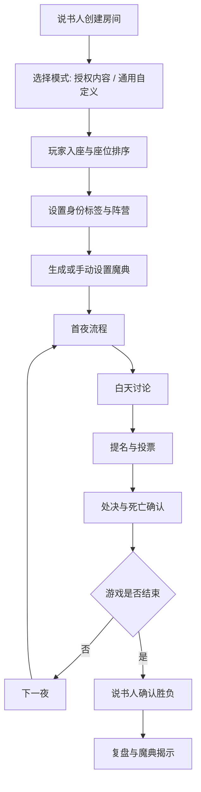

# 血染钟楼 / 通用说书人线下辅助工具设计规划书

> 文档版本：v0.1
> 生成日期：2026-06-30
> 适用阶段：产品立项、授权评估、MVP 范围确认、研发拆解
> 产品形态：Web / PWA 优先；说书人平板端为核心，玩家手机端与公共屏为辅助
> 重要提示：本文是产品与技术规划，不构成法律意见。公开上线或商业化前，请重点确认 The Pandemonium Institute 对 Blood on the Clocktower 相关数字工具、角色、规则、图像、商标和官方术语的授权要求。

---

## 1. 项目背景

血染钟楼是一款由说书人主持的隐藏身份社交推理游戏。官方介绍将其描述为面向 5–20 名玩家和 1 名说书人的谋杀、神秘、谎言、逻辑、推理与欺骗游戏。游戏中玩家分为善恶阵营，围绕公开讨论、私聊、提名、投票、处决、夜晚行动和说书人掌控的信息展开博弈。

与阿瓦隆不同，血染钟楼的关键并不是“自动规则判定”，而是说书人对局势、信息、节奏和玩家体验的管理。因此，本工具的核心定位应是“说书人魔典与流程辅助器”，而不是替代说书人的自动主持程序。

### 1.1 关键差异

| 维度 | 阿瓦隆类工具 | 血染钟楼 / 说书人工具 |
|---|---|---|
| 核心使用者 | 全体玩家 | 说书人 |
| 自动化程度 | 可较高 | 必须谨慎，保留人工裁量 |
| 隐藏状态复杂度 | 中等 | 极高 |
| 规则流程 | 相对固定 | 受剧本、角色、状态、说书人判断影响 |
| 玩家手机使用 | 可以较多 | 应较轻，避免打断线下讨论 |
| 公共屏 | 展示任务板 | 展示座位、死亡、提名、票数等公开信息 |
| 复盘重点 | 队伍、投票、任务、刺杀 | 魔典、夜晚行动、信息、状态变化、提名投票 |

---

## 2. 合规与产品路线

The Pandemonium Institute 的公开条款说明，涉及 Blood on the Clocktower 的数字工具、角色、规则、图像或其他相关内容存在明确授权边界；官方还强调不应让自制内容被误认为官方授权或关联产品。社区内容政策中也说明，直接竞争官方资源或试图给出角色互动“最终裁定”的工具可能不被批准，因为游戏中的模糊性是设计的一部分。

因此，本产品建议从第一天就分为两条路线：

| 路线 | 适用情况 | 产品策略 |
|---|---|---|
| 授权版 | 已获得 TPI 明确授权 | 可按授权范围内置官方角色、剧本、夜晚顺序、术语、规则提示和视觉资源 |
| 去 IP 通用版 | 未获得授权但要公开发布或商业化 | 做成“通用说书人魔典工具”，不内置官方角色文本、官方剧本名、官方图像、完整规则文本或商标化视觉元素 |

### 2.1 未授权公开版的边界建议

未获得授权前，公开产品建议遵守以下原则：

- 产品名称避免使用“官方”“血染钟楼官方助手”等容易造成关联误解的表达。
- 不内置官方角色列表、角色能力文本、官方剧本名称、官方图像和图标。
- 允许用户自定义“身份标签”“状态标签”“夜晚顺序”，但不要提供官方内容数据库。
- 不提供角色互动的最终规则裁定。
- 不复制官方说明书、Wiki 或角色页的大段文本。
- 公共宣传中强调“通用线下说书辅助工具”，而不是“官方线上版替代品”。
- 若后续获得授权，再单独开启官方内容包。

### 2.2 授权版可增强内容

获得授权后可考虑：

- 官方角色库。
- 官方剧本选择。
- 官方夜晚顺序。
- 官方术语与本地化。
- 官方规则速查。
- 官方视觉资产。
- 官方脚本导入/导出兼容。
- 与官方线上生态的允许范围内集成。

---

## 3. 产品目标与非目标

### 3.1 产品目标

| 目标 | 说明 |
|---|---|
| 降低说书人负担 | 快速记录身份、阵营、存活、死亡、提醒物、夜晚行动和投票 |
| 保护魔典隐私 | 玩家端和公共屏永不展示隐藏身份、隐藏状态和说书人备注 |
| 保留人工裁量 | 所有结果、信息、死亡和状态均允许说书人手动覆盖 |
| 支持复杂时间线 | 记录每夜行动、白天提名、投票、处决和关键状态变化 |
| 适合线下体验 | 不把线下讨论迁移到手机里，手机只做轻辅助 |
| 支持合规扩展 | 未授权版为通用自定义工具，授权后再增加官方内容 |

### 3.2 非目标

第一版不做：

- 不自动判断谁是恶魔或谁应被处决。
- 不给玩家阵营概率或策略建议。
- 不自动输出角色互动最终裁定。
- 不替代说书人决定给出真信息或假信息。
- 不在未授权状态下内置官方角色能力文本。
- 不保存玩家私聊内容。
- 不强制玩家用手机完成全部游戏操作。

---

## 4. 用户角色

| 用户角色 | 权限 | 核心诉求 |
|---|---|---|
| 说书人 | 最高权限 | 管理魔典、夜晚、白天、提名、投票、死亡和复盘 |
| 玩家 | 个人权限 | 查看座位、记录笔记、可选接收私密信息或提交夜晚选择 |
| 公共屏 | 只读公开权限 | 展示座位、存活死亡、提名、票数、计时 |
| 观战 / 复盘者 | 赛后权限 | 在游戏结束后查看开放的复盘内容 |
| 桌游店管理员 | 场次管理权限 | 多局排班、主持人分配、活动记录 |

---

## 5. 使用设备与端设计

| 端 | 推荐设备 | 定位 |
|---|---|---|
| 说书人端 | 平板 / 笔记本 | 主魔典、夜晚流程、状态管理、投票记录 |
| 玩家端 | 手机 | 入座、个人笔记、可选私密信息、可选夜晚选择 |
| 公共屏 | 投影 / 电视 / 大屏 | 公开座位、存活死亡、提名投票、计时 |
| 后台端 | 电脑 | 剧本配置、历史局、桌游店运营 |

第一版应优先做好说书人端。玩家端和公共屏是辅助，不应喧宾夺主。

---

## 6. 核心设计原则

| 原则 | 说明 |
|---|---|
| 说书人优先 | 说书人必须能在 1–2 秒内完成常用操作 |
| 魔典绝对安全 | 任何隐藏信息不得误出现在公共屏或玩家端 |
| 不强制判定 | 工具只提醒和记录，不替说书人裁定复杂交互 |
| 可撤销 | 状态、提醒物、死亡、投票等关键操作支持撤销 |
| 可覆盖 | 所有自动建议都可手动覆盖 |
| 低干扰 | 玩家端尽量少用，避免手机替代发言 |
| 可复盘 | 每个白天、夜晚和关键状态变化均可进入时间线 |
| 合规可切换 | 未授权时为通用模式，授权后启用官方内容包 |

---

## 7. 核心流程

### 7.1 总流程



### 7.2 创建房间

1. 说书人创建房间。
2. 选择产品模式：通用说书人工具 / 授权内容模式。
3. 选择玩家人数。
4. 生成二维码，玩家扫码入座。
5. 说书人调整座位顺序，使之与线下圆桌一致。
6. 选择是否启用玩家手机私密信息。
7. 选择是否启用公共屏。
8. 进入魔典设置。

### 7.3 魔典设置

在通用版中，系统不预置官方内容，而是提供可编辑字段：

| 字段 | 说明 |
|---|---|
| 玩家名 | 座位上的玩家昵称 |
| 身份标签 | 用户自定义文本，例如“角色 A”“信息位 1”等 |
| 阵营 | 善 / 恶 / 中立 / 旅行者 / 自定义 |
| 存活状态 | 活着 / 死亡 |
| 鬼票状态 | 可用 / 已用 / 不适用 |
| 提醒物 | 自定义标签，可拖拽到玩家身上 |
| 夜晚顺序 | 自定义行动清单 |
| 说书人备注 | 仅说书人可见 |

授权版可以将“身份标签”替换为官方角色 token，将“夜晚顺序”替换为官方剧本对应流程。

### 7.4 夜晚流程

夜晚是说书人端的核心流程。工具应以“清单 + 魔典 + 快速记录”为主。

1. 说书人点击“开始第 N 夜”。
2. 系统展示夜晚行动清单。
3. 当前行动项高亮相关玩家。
4. 说书人可记录玩家选择的目标。
5. 说书人可记录给出的信息。
6. 说书人可添加、移动、删除提醒物。
7. 说书人可标记死亡、保护、异常状态等。
8. 每个行动项可完成、跳过、插入、回退。
9. 夜晚结束前展示“待确认事项”。
10. 进入白天，公共屏只显示公开死亡结果和座位状态。

夜晚模块的关键不是自动给答案，而是帮助说书人不漏流程、不漏状态、不忘记录。

### 7.5 白天流程

白天以线下发言为主，工具主要提供计时、提名、投票和公开状态记录。

1. 说书人点击“开始白天”。
2. 公共屏显示存活/死亡状态和白天计时。
3. 玩家自由公开讨论或线下私聊。
4. 说书人可开启提名阶段。
5. 某玩家提名另一玩家，系统记录提名者和被提名者。
6. 系统按座位顺序辅助计票。
7. 说书人确认票数是否达到处决要求。
8. 说书人确认是否处决、是否死亡、是否继续白天。
9. 系统更新死亡状态和鬼票状态。
10. 白天结束后进入下一夜或结算。

### 7.6 提名与投票

| 功能 | 说明 |
|---|---|
| 提名记录 | 记录提名者、被提名者、时间点 |
| 重复提名限制提示 | 按配置提醒，不强制阻断 |
| 座位顺序计票 | 公共屏按圆桌顺序高亮当前计票位置 |
| 死亡玩家投票 | 可标记鬼票是否消耗 |
| 票数确认 | 说书人确认最终票数 |
| 平票 / 未达门槛 | 系统提示，但允许说书人覆盖 |
| 处决确认 | 说书人手动确认是否处决和死亡 |
| 投票历史 | 自动进入复盘时间线 |

### 7.7 游戏结束与复盘

血染钟楼存在大量角色、剧本和状态变体，因此工具不应强制自动结算。推荐由说书人手动确认：

- 胜利阵营。
- 胜负原因。
- 是否公开完整魔典。
- 是否公开夜晚记录。
- 是否导出复盘图片。
- 是否删除私密备注。

复盘应包含：

| 内容 | 说明 |
|---|---|
| 最终座位图 | 玩家、身份、阵营、存活状态 |
| 魔典变化 | 每个阶段的身份、状态、提醒物变动 |
| 夜晚时间线 | 夜晚行动、目标、信息、死亡 |
| 白天时间线 | 提名、投票、处决、死亡 |
| 鬼票记录 | 死亡玩家是否使用鬼票 |
| 说书人备注 | 默认不公开，可由说书人选择是否导出 |

---

## 8. 页面与信息架构

| 页面 | 使用者 | 内容 |
|---|---|---|
| 创建房间页 | 说书人 | 模式、人数、公共屏、玩家端设置 |
| 玩家入座页 | 全员 | 二维码、座位、昵称、准备状态 |
| 魔典页 | 说书人 | 圆桌、身份、阵营、状态、提醒物、备注 |
| 夜晚流程页 | 说书人 | 夜晚行动清单、目标记录、信息记录 |
| 白天管理页 | 说书人 | 计时、提名、投票、处决 |
| 公共屏页 | 全员 | 座位、存活/死亡、提名、票数、计时 |
| 玩家个人页 | 玩家 | 个人笔记、可选私密信息、可选夜晚选择 |
| 复盘页 | 全员 / 观战 | 魔典揭示、时间线、投票记录 |
| 剧本配置页 | 说书人 / 管理员 | 通用自定义剧本或授权内容配置 |
| 历史局页 | 说书人 / 管理员 | 历史复盘、导出、删除 |

---

## 9. 信息可见性矩阵

| 信息 / 操作 | 说书人端 | 玩家端 | 公共屏 | 复盘页 |
|---|---:|---:|---:|---:|
| 玩家座位 | 可见/可改 | 可见 | 可见 | 可见 |
| 存活/死亡 | 可见/可改 | 可见 | 可见 | 可见 |
| 身份/角色 | 可见/可改 | 默认不可见，授权/配置后可显示自己信息 | 不可见 | 结束后按设置可见 |
| 阵营 | 可见/可改 | 默认不可见 | 不可见 | 结束后按设置可见 |
| 提醒物 | 可见/可改 | 不可见，除非设为公开 | 默认不可见 | 结束后按设置可见 |
| 说书人备注 | 可见/可改 | 不可见 | 不可见 | 默认不公开 |
| 夜晚行动清单 | 可见/可改 | 不可见 | 不可见 | 结束后按设置可见 |
| 玩家夜晚目标 | 可见/可改 | 仅本人提交页可见 | 不可见 | 结束后按设置可见 |
| 私密信息 | 可见/可改 | 仅接收者可见 | 不可见 | 默认不公开 |
| 提名 | 可见/可改 | 可见 | 可见 | 可见 |
| 投票 | 可见/可改 | 可见 | 可见 | 可见 |
| 鬼票状态 | 可见/可改 | 可见 | 可见 | 可见 |
| 胜负结果 | 可见/可改 | 可见 | 可见 | 可见 |

---

## 10. 功能模块

### 10.1 P0：MVP 必须实现

| 模块 | 功能 | 说明 |
|---|---|---|
| 房间系统 | 创建房间、二维码入座、断线重连 | 不强制注册 |
| 座位系统 | 圆桌布局、座位排序、昵称编辑 | 与线下座位一致 |
| 魔典系统 | 身份标签、阵营、存活、死亡、鬼票 | 说书人核心工作区 |
| 提醒物系统 | 自定义提醒物、拖拽、移除 | 记录持续状态和目标关系 |
| 夜晚系统 | 自定义夜晚顺序、行动完成、跳过、插入 | 不强制规则判断 |
| 白天系统 | 计时、提名、投票、处决 | 公共屏可同步公开信息 |
| 复盘系统 | 最终魔典、夜晚/白天时间线 | 游戏结束后查看 |
| 权限系统 | 说书人、玩家、公共屏分权 | 防止魔典泄露 |
| 审计日志 | 记录关键变更 | 支持撤销和复盘 |

### 10.2 P1：增强体验

| 模块 | 功能 | 说明 |
|---|---|---|
| 玩家笔记 | 玩家个人怀疑记录 | 本地或私密保存 |
| 私密信息发送 | 说书人向指定玩家发送信息 | 可选功能，线下优先口头/手势 |
| 夜晚目标提交 | 玩家端提交夜晚选择，说书人确认 | 适合大局或远距离座位 |
| 公共屏优化 | 提名动画、计票环、死亡状态 | 只展示公开信息 |
| 多魔典快照 | 每夜/每天自动快照 | 便于回溯 |
| 导出复盘图 | 长图或 PDF | 默认隐藏私密备注 |
| 剧本模板 | 用户自定义模板 | 未授权版不内置官方内容 |

### 10.3 P2：长期能力

| 模块 | 功能 | 说明 |
|---|---|---|
| 授权内容包 | 官方角色、剧本、夜晚顺序、术语 | 获得授权后启用 |
| 桌游店后台 | 活动排期、主持人管理、多桌监控 | 商业化方向 |
| 进阶复盘 | 状态时间轴、玩家视角回放 | 高阶社群使用 |
| 多语言 | 中文、英文等 | 国际化 |
| 离线模式 | 弱网局本地运行 | 线下场景关键 |
| 可访问性 | 大字、色盲模式、触控优化 | 降低说书人操作负担 |

---

## 11. 授权版与通用版功能对照

| 功能 | 通用未授权版 | 授权版 |
|---|---|---|
| 产品名称 | 通用说书人助手 | 可按授权使用相关名称 |
| 官方角色库 | 不内置 | 可内置 |
| 官方角色能力文本 | 不内置 | 可按授权展示 |
| 官方剧本名称 | 不内置 | 可内置 |
| 官方夜晚顺序 | 不内置 | 可内置 |
| 官方图像 / token | 不使用 | 可按授权使用 |
| 自定义身份标签 | 支持 | 支持 |
| 自定义提醒物 | 支持 | 支持 |
| 自定义夜晚顺序 | 支持 | 支持 |
| 角色互动裁定 | 不做最终裁定 | 仍建议只提示，不替代说书人 |
| 商业化 | 需规避 IP 风险 | 按授权协议执行 |

---

## 12. 数据模型草案

```ts
type GameMode = "generic_storyteller" | "licensed_botc";

type GameStatus =
  | "lobby"
  | "setup"
  | "night"
  | "day"
  | "nomination"
  | "execution"
  | "finished";

type SeatStatus = "alive" | "dead";

type GhostVoteStatus = "available" | "used" | "not_applicable";

interface GameSession {
  id: string;
  gameType: "storyteller";
  mode: GameMode;
  status: GameStatus;
  storytellerUserId: string;
  playerCount: number;
  currentDay: number;
  currentNight: number;
  createdAt: string;
  endedAt?: string;
}

interface Seat {
  id: string;
  sessionId: string;
  seatIndex: number;
  playerName: string;
  playerUserId?: string;
  status: SeatStatus;
  ghostVoteStatus: GhostVoteStatus;
  isTraveler?: boolean;
  publicNote?: string;
}

interface GrimoireToken {
  id: string;
  sessionId: string;
  seatId: string;
  characterKey?: string;
  customLabel?: string;
  alignment: "good" | "evil" | "neutral" | "traveler" | "custom";
  isBluff?: boolean;
  storytellerNote?: string;
  createdAt: string;
  updatedAt: string;
}

interface ReminderToken {
  id: string;
  sessionId: string;
  label: string;
  colorKey?: string;
  sourceLabel?: string;
  seatId?: string;
  visibility: "storyteller_only" | "public";
  active: boolean;
  createdAt: string;
  updatedAt: string;
}

interface NightOrderItem {
  id: string;
  sessionId: string;
  orderIndex: number;
  phaseType: "first_night" | "other_night" | "custom";
  actorSeatId?: string;
  actorLabel?: string;
  promptText?: string;
  completed: boolean;
  skipped: boolean;
}

interface NightActionLog {
  id: string;
  sessionId: string;
  nightNumber: number;
  orderItemId?: string;
  actorSeatId?: string;
  targetSeatIds: string[];
  informationGiven?: string;
  storytellerNote?: string;
  createdAt: string;
}

interface Nomination {
  id: string;
  sessionId: string;
  dayNumber: number;
  nominatorSeatId: string;
  nomineeSeatId: string;
  voteCount?: number;
  executed: boolean;
  createdAt: string;
}

interface VoteRecord {
  id: string;
  nominationId: string;
  seatId: string;
  voted: boolean;
  usedGhostVote: boolean;
  createdAt: string;
}

interface DeathEvent {
  id: string;
  sessionId: string;
  seatId: string;
  phase: "night" | "day" | "execution" | "custom";
  causeLabel?: string;
  public: boolean;
  createdAt: string;
}

interface GameResult {
  sessionId: string;
  winningSide: "good" | "evil" | "other";
  reasonLabel: string;
  confirmedBy: string;
  revealedAt: string;
}

interface AuditLog {
  id: string;
  sessionId: string;
  actorUserId: string;
  actionType: string;
  payload: Record<string, unknown>;
  reversible: boolean;
  createdAt: string;
}
```

---

## 13. 实时事件设计

| 事件 | 发送方 | 接收方 | 用途 |
|---|---|---|---|
| `seat.joined` | 玩家 | 说书人 / 公共屏 | 玩家入座 |
| `seat.updated` | 说书人 | 全员按权限 | 更新座位、昵称、死亡状态 |
| `grimoire.updated` | 说书人 | 说书人端 | 更新魔典隐藏状态 |
| `public_state.updated` | 服务端 | 玩家 / 公共屏 | 同步公开状态 |
| `night.started` | 说书人 | 说书人端 / 可选玩家端 | 开始夜晚 |
| `night_item.completed` | 说书人 | 说书人端 | 夜晚行动完成 |
| `private_message.sent` | 说书人 | 指定玩家 | 发送私密信息 |
| `nomination.created` | 说书人 | 全员 | 创建提名 |
| `vote.recorded` | 说书人 | 公共屏 / 玩家 | 更新公开票数 |
| `execution.confirmed` | 说书人 | 全员 | 确认处决结果 |
| `death.updated` | 说书人 | 全员按权限 | 更新公开死亡状态 |
| `game.finished` | 说书人 | 全员 | 游戏结束 |
| `review.revealed` | 说书人 | 全员按设置 | 开放复盘 |

---

## 14. 说书人端交互设计

### 14.1 魔典视图

魔典是说书人端首页，采用圆桌布局：

- 玩家以圆环分布，顺序与线下座位一致。
- 每个玩家卡片显示：昵称、存活状态、鬼票、身份标签、阵营、提醒物。
- 点击玩家打开详情面板。
- 长按玩家快速添加提醒物。
- 拖拽提醒物到玩家身上完成绑定。
- 右侧面板显示夜晚清单或白天投票面板。
- 顶部显示当前阶段：设置 / 第 N 夜 / 第 N 天 / 提名 / 结算。

### 14.2 快速操作

说书人最常用操作必须在 1–2 秒内完成：

| 操作 | 推荐交互 |
|---|---|
| 标记死亡 | 点击玩家 → 死亡按钮，或快捷手势 |
| 使用鬼票 | 投票面板勾选后自动消耗 |
| 添加提醒物 | 拖拽标签到玩家 |
| 修改身份标签 | 点击玩家详情面板编辑 |
| 记录目标 | 夜晚行动项中点击目标玩家 |
| 记录信息 | 快捷文本框或语音转文字可选 |
| 撤销 | 顶部固定撤销按钮 |
| 快照 | 每夜/每天自动保存，也可手动保存 |

### 14.3 防误触

- 删除身份、清空魔典、公开复盘等危险操作需二次确认。
- 公共屏开关与说书人端魔典严格分离。
- 说书人端进入后台后自动锁屏，重新打开需要解锁。
- 关键操作出现 toast，并可在 5 秒内撤销。

---

## 15. 玩家端设计

玩家端应轻量化。

### 15.1 MVP 玩家端

| 功能 | 说明 |
|---|---|
| 扫码入座 | 输入昵称，选择座位或由说书人安排 |
| 查看公开状态 | 座位、存活、死亡、当前提名、票数 |
| 个人笔记 | 仅自己可见，默认不上传或加密保存 |
| 复盘查看 | 游戏结束后按说书人设置查看 |

### 15.2 可选玩家端

| 功能 | 说明 | 风险 |
|---|---|---|
| 接收私密信息 | 说书人向指定玩家发送文本 | 可能改变线下手势体验 |
| 夜晚目标选择 | 玩家手机提交目标，说书人确认 | 可能增加看手机频率 |
| 投票辅助 | 手机记录投票 | 可能与线下举手冲突 |

默认建议保留线下举手和说书人口头/手势信息，将手机作为兜底工具，而不是主流程。

---

## 16. 公共屏设计

公共屏只显示公开信息。

### 16.1 可展示

- 玩家座位。
- 存活 / 死亡。
- 鬼票可用 / 已用。
- 当前阶段。
- 白天计时。
- 当前提名者与被提名者。
- 公开票数。
- 处决结果。
- 最终胜负。

### 16.2 禁止展示

- 身份/角色。
- 阵营。
- 隐藏提醒物。
- 夜晚行动目标。
- 说书人备注。
- 私密信息。
- 未公开死亡原因。
- 授权范围外的官方素材。

---

## 17. 异常与边界场景

| 场景 | 处理方案 |
|---|---|
| 玩家断线 | 不影响主流程，玩家端只是辅助；说书人可继续 |
| 公共屏误开 | 公共屏 token 只读且无隐藏信息 |
| 说书人误标死亡 | 支持撤销和审计日志 |
| 夜晚行动漏处理 | 夜晚结束前显示未完成清单 |
| 需要临时插入行动 | 夜晚清单支持插入自定义行动 |
| 角色/状态复杂互动 | 工具只记录和提醒，不强制裁定 |
| 玩家偷看魔典 | 说书人端自动锁屏，魔典不在公共屏显示 |
| 平票或特殊处决条件 | 系统提示，最终由说书人确认 |
| 鬼票争议 | 投票历史中记录每次消耗 |
| 授权内容不可用 | 自动降级为通用自定义模式 |

---

## 18. 安全、隐私与数据保留

### 18.1 权限架构

| 权限层 | 能看到什么 |
|---|---|
| 说书人权限 | 全部魔典、隐藏状态、私密备注、夜晚记录 |
| 玩家权限 | 公开状态、个人笔记、自己收到的私密信息 |
| 公共屏权限 | 公开状态，只读 |
| 复盘权限 | 说书人选择公开的内容 |
| 管理员权限 | 房间元数据，不应默认查看局内隐藏信息 |

### 18.2 数据保留策略

建议默认：

- 游戏中保存完整数据。
- 游戏结束后复盘默认保留 24 小时。
- 说书人可一键删除整局数据。
- 玩家个人笔记默认仅自己可见，可选择不上传。
- 复盘导出默认不包含说书人私密备注。
- 商业场景需提供隐私政策、数据删除入口和活动录制告知。

### 18.3 防泄露策略

- 魔典接口只允许说书人 token 调用。
- 公共屏使用单独只读 token，无法升级为说书人权限。
- 玩家端接口永不返回完整魔典。
- 复盘公开前必须由说书人确认范围。
- 服务端日志避免记录明文私密信息，必要时做脱敏或加密。

---

## 19. MVP 范围

### 19.1 通用说书人 MVP

```text
P0 MVP
- 创建房间
- 二维码入座
- 圆桌座位布局
- 玩家昵称和座位排序
- 自定义身份标签
- 自定义阵营
- 存活 / 死亡状态
- 鬼票状态
- 自定义提醒物
- 提醒物拖拽到玩家
- 说书人私密备注
- 自定义夜晚顺序
- 夜晚行动完成 / 跳过 / 插入
- 夜晚目标记录
- 白天计时
- 提名记录
- 投票记录
- 鬼票消耗记录
- 处决确认
- 游戏结束手动确认胜负
- 最终魔典复盘
- 白天 / 夜晚时间线
- 公共屏公开状态
- 权限隔离
- 审计日志与撤销
```

### 19.2 暂不做

```text
MVP 暂不做
- 官方角色库
- 官方角色能力文本
- 官方剧本名称
- 官方图像或 token
- 自动角色互动裁定
- AI 推理建议
- 玩家线上私聊
- 多桌后台
- 长期战绩系统
- 复杂脚本市场
```

---

## 20. 研发拆解建议

| 里程碑 | 周期建议 | 交付物 |
|---|---:|---|
| M1：房间与座位 | 1 周 | 创建房间、扫码入座、圆桌布局 |
| M2：魔典基础 | 2 周 | 身份标签、阵营、死亡、鬼票、备注 |
| M3：提醒物与夜晚 | 2 周 | 提醒物拖拽、自定义夜晚顺序、行动日志 |
| M4：白天投票 | 1–2 周 | 计时、提名、投票、处决、公共屏 |
| M5：复盘与权限 | 1–2 周 | 时间线、复盘、权限隔离、审计日志 |
| M6：稳定性与合规检查 | 1 周 | 弱网、锁屏、防泄露、内容边界审查 |

---

## 21. 验收标准

| 验收项 | 标准 |
|---|---|
| 魔典安全 | 玩家端和公共屏无法看到身份、阵营、隐藏提醒物或说书人备注 |
| 操作效率 | 说书人能在 2 秒内完成标记死亡、使用鬼票、添加提醒物等常用操作 |
| 圆桌一致 | 屏幕座位顺序与线下座位一致，支持快速调整 |
| 夜晚流程 | 支持完成、跳过、插入、回退夜晚行动 |
| 白天流程 | 能记录提名、投票、处决和死亡 |
| 鬼票管理 | 死亡玩家鬼票可用/已用状态准确记录，并进入复盘 |
| 手动覆盖 | 所有状态、投票、死亡、胜负均可由说书人手动修正 |
| 审计日志 | 关键操作均有日志，可用于撤销和复盘 |
| 复盘完整 | 最终魔典、夜晚行动、白天提名、投票、处决均可查看 |
| 合规边界 | 未授权模式下不内置官方角色文本、官方剧本、官方图像或商标化视觉资产 |

---

## 22. 风险与应对

| 风险 | 影响 | 应对 |
|---|---|---|
| IP / 授权风险 | 公开上线或商业化受阻 | 未授权先做通用版；授权后再启用官方内容包 |
| 魔典泄露 | 直接毁局 | 公共屏隔离、权限分层、说书人端锁屏 |
| 自动化过强 | 破坏说书人自由裁量 | 工具只提醒与记录，不做最终裁定 |
| 玩家手机干扰 | 线下讨论质量下降 | 玩家端只做入座、笔记、可选私密信息 |
| 复杂状态遗漏 | 说书人漏处理 | 夜晚清单、提醒物、待确认事项、快照 |
| 误操作 | 错误死亡或错误公开 | 撤销、审计日志、危险操作二次确认 |
| 复盘泄露私密备注 | 玩家不适 | 默认不公开备注，导出前选择公开范围 |
| 说书人学习成本高 | 工具反而增加负担 | 魔典首页操作极简，常用动作快捷化 |

---

## 23. 后续路线图

| 阶段 | 功能方向 |
|---|---|
| v0.2 | 公共屏优化、复盘长图、玩家个人笔记 |
| v0.3 | 自定义剧本模板、夜晚顺序模板、魔典快照 |
| v0.4 | 桌游店活动后台、多桌管理、主持人排班 |
| v0.5 | 授权评估后接入官方内容包 |
| v1.0 | 与阿瓦隆等社交推理工具共用平台房间、权限、复盘和活动系统 |

---

## 24. 实现素材清单

本工具在未获得 The Pandemonium Institute 明确授权前，必须按“通用说书人工具”制作素材。默认素材不得使用 Blood on the Clocktower 官方角色图标、角色名图形、官方剧本图、官方 Logo、官方魔典视觉、官方夜晚顺序图或 Wiki / 规则页截图。所有素材应围绕“线下说书、圆桌、笔记、状态标记、公共投屏”建立原创视觉体系。

### 24.1 素材存储路径约定

| 目录 | 用途 |
|---|---|
| `apps/web/public/game-tools/common/` | 多个线下桌游工具共用素材，例如二维码、圆桌、隐私遮罩、计时器、空状态 |
| `apps/web/public/game-tools/storyteller/` | 通用说书人工具专用素材，未授权版本默认使用 |
| `apps/web/public/game-tools/storyteller/tokens/` | 通用身份、阵营、状态、提醒物 token |
| `apps/web/public/game-tools/storyteller/grimoire/` | 魔典背景、座位圈、拖拽状态、夜晚清单素材 |
| `apps/web/public/game-tools/storyteller/public-screen/` | 公共屏素材，只含公开信息视觉 |
| `apps/web/public/game-tools/storyteller/share/` | 复盘图、OG 图、导出模板 |
| `apps/web/public/game-tools/storyteller/audio/` | 可选轻提示音，第一版可不接入 |
| `apps/web/public/game-tools/botc-licensed/` | 仅在获得授权后使用的官方内容包目录，未授权阶段不得放入官方资产 |

### 24.2 通用共用素材

| 文件路径 | 素材内容 | 用途 | 格式与规格 |
|---|---|---|---|
| `apps/web/public/game-tools/common/game-room-qr-frame.svg` | Friemi 风格二维码外框，圆角、纸感底纹、不含文案 | 玩家入座、公共屏扫码 | SVG，透明背景 |
| `apps/web/public/game-tools/common/round-table-seat-map.svg` | 俯视圆桌座位底图，可叠加玩家头像和状态 | 圆桌座位、公共屏座位图 | SVG，1024x1024 viewBox |
| `apps/web/public/game-tools/common/seat-avatar-placeholder.svg` | 默认座位头像 | 临时玩家、匿名玩家 | SVG，透明背景 |
| `apps/web/public/game-tools/common/privacy-blur-pattern.svg` | 防窥遮罩纹理 | 说书人端锁屏、私密备注收起 | SVG pattern |
| `apps/web/public/game-tools/common/offline-reconnect-card.svg` | 断线重连插画 | 玩家端 / 说书人端断线提示 | SVG，640x360 |
| `apps/web/public/game-tools/common/timer-ring.svg` | 倒计时圆环 | 白天讨论、提名、夜晚流程节奏 | SVG，支持 CSS 改色 |
| `apps/web/public/game-tools/common/public-screen-corner-mark.svg` | 只读公共屏角标 | 投屏页面防误触 / 权限提示 | SVG，透明背景 |
| `apps/web/public/game-tools/common/confetti-soft-burst.json` | 低干扰庆祝动效 | 结算、复盘导出成功 | Lottie JSON，低于 80KB |

### 24.3 工具入口与说书人端主视觉

| 文件路径 | 素材内容 | 用途 | 格式与规格 |
|---|---|---|---|
| `apps/web/public/game-tools/storyteller/storyteller-tool-icon.svg` | 原创“笔记本 + 月相 + 圆桌点位”图标，不使用官方钟楼元素 | 工具入口、桌游分类卡片、PWA 快捷入口 | SVG，24/48/96px 清晰 |
| `apps/web/public/game-tools/storyteller/storyteller-hero-mobile.webp` | 手机端入口主视觉：说书人手账、圆桌座位、状态贴纸，不含官方 token | 移动端工具首页 | WebP，900x1200，低于 250KB |
| `apps/web/public/game-tools/storyteller/storyteller-hero-desktop.webp` | 桌面端横版主视觉：平板魔典、线下桌面、柔和灯光 | 桌面 / 平板工具首页 | WebP，1600x900，低于 350KB |
| `apps/web/public/game-tools/storyteller/storyteller-empty-room.svg` | 空房间插画：空圆桌、说书人笔记、等待座位 | 创建房间后无人入座 | SVG，640x420 |
| `apps/web/public/game-tools/storyteller/storyteller-lock-screen.svg` | 说书人端防窥锁屏插画 | 魔典锁屏、后台切换回来时 | SVG，640x420 |
| `apps/web/public/game-tools/storyteller/storyteller-danger-confirm.svg` | 危险操作确认插画：删除、公开魔典、结束游戏 | 二次确认弹窗 | SVG，360x240 |

### 24.4 魔典与圆桌素材

这些素材是工具核心。它们必须保证“说书人端清楚、公共屏不会泄露隐藏信息”。魔典素材不应模仿官方魔典或官方 token 版式。

| 文件路径 | 素材内容 | 用途 | 格式与规格 |
|---|---|---|---|
| `apps/web/public/game-tools/storyteller/grimoire/grimoire-board-bg.svg` | 原创魔典工作台背景，浅纸感、淡绿色边界、可放座位圆环 | 说书人端魔典主画布 | SVG，1440x960 viewBox |
| `apps/web/public/game-tools/storyteller/grimoire/grimoire-board-bg-dark.svg` | 深色防窥魔典背景 | 夜间模式 / 低光环境 | SVG，1440x960 viewBox |
| `apps/web/public/game-tools/storyteller/grimoire/seat-ring-active.svg` | 当前选中座位环 | 魔典座位选中态 | SVG，96x96 |
| `apps/web/public/game-tools/storyteller/grimoire/seat-ring-dead.svg` | 死亡玩家座位环 | 魔典和公共屏死亡态 | SVG，96x96 |
| `apps/web/public/game-tools/storyteller/grimoire/seat-ring-nominated.svg` | 被提名玩家座位环 | 白天提名流程 | SVG，96x96 |
| `apps/web/public/game-tools/storyteller/grimoire/seat-ring-voting.svg` | 当前计票座位环 | 投票计数流程 | SVG，96x96 |
| `apps/web/public/game-tools/storyteller/grimoire/drag-target-glow.svg` | 拖拽提醒物时的可放置光晕 | 魔典拖拽交互 | SVG，透明背景 |
| `apps/web/public/game-tools/storyteller/grimoire/night-checklist-bg.svg` | 夜晚行动清单卡片底纹 | 夜晚流程侧栏 | SVG，480x900 viewBox |
| `apps/web/public/game-tools/storyteller/grimoire/day-timeline-bg.svg` | 白天流程时间线底纹 | 白天提名 / 投票记录 | SVG，480x900 viewBox |
| `apps/web/public/game-tools/storyteller/grimoire/private-note-paper.svg` | 说书人私密备注纸片 | 玩家备注、夜晚备注 | SVG，320x220 |
| `apps/web/public/game-tools/storyteller/grimoire/snapshot-frame.svg` | 魔典快照边框 | 撤销、历史快照、复盘 | SVG，1200x800 viewBox |

### 24.5 通用身份、阵营与提醒物 token

未授权版本只做“自定义标签容器”，不内置官方角色能力。图标必须抽象化、可复用，并允许用户自己输入身份名、阵营名、提醒物名。

| 文件路径 | 素材内容 | 用途 | 格式与规格 |
|---|---|---|---|
| `apps/web/public/game-tools/storyteller/tokens/alignment-good.svg` | 通用善方阵营 token，晨光 / 叶片 / 星点抽象符号 | 阵营选择、复盘筛选 | SVG，96x96 |
| `apps/web/public/game-tools/storyteller/tokens/alignment-evil.svg` | 通用恶方阵营 token，暗月 / 裂纹 / 墨点抽象符号 | 阵营选择、复盘筛选 | SVG，96x96 |
| `apps/web/public/game-tools/storyteller/tokens/alignment-neutral.svg` | 通用中立阵营 token | 自定义阵营 | SVG，96x96 |
| `apps/web/public/game-tools/storyteller/tokens/alignment-traveler.svg` | 通用旅行者 / 临时身份 token，不使用官方称呼也可复用 | 扩展身份类型 | SVG，96x96 |
| `apps/web/public/game-tools/storyteller/tokens/role-token-blank.svg` | 空白身份 token 容器，可叠加用户输入文字 | 自定义身份标签 | SVG，透明中心区域 |
| `apps/web/public/game-tools/storyteller/tokens/role-token-info.svg` | 信息型身份容器，抽象眼睛 / 笔记符号 | 用户自定义信息位 | SVG，96x96 |
| `apps/web/public/game-tools/storyteller/tokens/role-token-power.svg` | 行动型身份容器，抽象手势 / 闪光符号 | 用户自定义行动位 | SVG，96x96 |
| `apps/web/public/game-tools/storyteller/tokens/role-token-protection.svg` | 保护型身份容器，抽象盾形 | 用户自定义保护位 | SVG，96x96 |
| `apps/web/public/game-tools/storyteller/tokens/role-token-chaos.svg` | 干扰型身份容器，抽象旋涡 / 错位点 | 用户自定义干扰位 | SVG，96x96 |
| `apps/web/public/game-tools/storyteller/tokens/reminder-token-blank.svg` | 空白提醒物 token，可叠加文字 | 自定义提醒物 | SVG，72x72 |
| `apps/web/public/game-tools/storyteller/tokens/reminder-token-poisoned.svg` | 通用异常状态 token，避免使用官方术语图案 | 状态提醒物模板 | SVG，72x72 |
| `apps/web/public/game-tools/storyteller/tokens/reminder-token-protected.svg` | 通用保护状态 token | 状态提醒物模板 | SVG，72x72 |
| `apps/web/public/game-tools/storyteller/tokens/reminder-token-targeted.svg` | 通用目标标记 token | 夜晚行动目标记录 | SVG，72x72 |
| `apps/web/public/game-tools/storyteller/tokens/reminder-token-used.svg` | 通用已使用能力 / 已消耗 token | 能力消耗、鬼票消耗 | SVG，72x72 |
| `apps/web/public/game-tools/storyteller/tokens/reminder-token-custom.svg` | 自定义提醒物默认 token | 用户新建提醒物默认图标 | SVG，72x72 |

### 24.6 存活、死亡、鬼票、提名与投票素材

| 文件路径 | 素材内容 | 用途 | 格式与规格 |
|---|---|---|---|
| `apps/web/public/game-tools/storyteller/tokens/status-alive.svg` | 存活状态图标 | 玩家状态、公共屏 | SVG，40x40 |
| `apps/web/public/game-tools/storyteller/tokens/status-dead.svg` | 死亡状态图标，克制不血腥 | 玩家状态、公共屏 | SVG，40x40 |
| `apps/web/public/game-tools/storyteller/tokens/ghost-vote-available.svg` | 鬼票可用图标，抽象票券 | 死亡玩家投票状态 | SVG，40x40 |
| `apps/web/public/game-tools/storyteller/tokens/ghost-vote-used.svg` | 鬼票已用图标 | 鬼票状态 | SVG，40x40 |
| `apps/web/public/game-tools/storyteller/tokens/nomination-token.svg` | 提名标记，小旗 / 聚光灯 | 被提名者状态 | SVG，48x48 |
| `apps/web/public/game-tools/storyteller/tokens/vote-hand-up.svg` | 举手投票图标 | 投票计数、公共屏 | SVG，48x48 |
| `apps/web/public/game-tools/storyteller/tokens/vote-no.svg` | 未投票 / 反对图标 | 投票历史 | SVG，48x48 |
| `apps/web/public/game-tools/storyteller/tokens/execution-confirm.svg` | 处决确认图标，抽象印章 | 二次确认、时间线 | SVG，48x48 |
| `apps/web/public/game-tools/storyteller/tokens/execution-none.svg` | 无处决图标 | 白天结束记录 | SVG，48x48 |

### 24.7 公共屏素材

公共屏素材只能承载公开状态，不得包含身份、阵营、提醒物或说书人备注。

| 文件路径 | 素材内容 | 用途 | 格式与规格 |
|---|---|---|---|
| `apps/web/public/game-tools/storyteller/public-screen/public-room-bg.svg` | 公共屏背景，淡色圆桌、座位光点、无隐藏信息 | 投屏主页面 | SVG，1920x1080 viewBox |
| `apps/web/public/game-tools/storyteller/public-screen/public-seat-card.svg` | 公开玩家座位卡底图 | 公共屏玩家列表 | SVG，320x180 |
| `apps/web/public/game-tools/storyteller/public-screen/day-phase-banner.svg` | 白天阶段横幅 | 公共屏阶段提示 | SVG，1200x160 |
| `apps/web/public/game-tools/storyteller/public-screen/night-phase-banner.svg` | 夜晚阶段横幅，只提示阶段，不透露行动 | 公共屏阶段提示 | SVG，1200x160 |
| `apps/web/public/game-tools/storyteller/public-screen/nomination-banner.svg` | 提名阶段横幅 | 提名与投票公共屏 | SVG，1200x160 |
| `apps/web/public/game-tools/storyteller/public-screen/vote-count-track.svg` | 投票计数轨道 | 公共屏计票 | SVG，1200x180 |
| `apps/web/public/game-tools/storyteller/public-screen/public-timer-bg.svg` | 公共计时器背景 | 讨论 / 提名倒计时 | SVG，360x360 |
| `apps/web/public/game-tools/storyteller/public-screen/public-safe-mode.svg` | 公共屏安全模式插画 | 公共屏权限异常或隐藏模式 | SVG，640x360 |

### 24.8 复盘与分享素材

| 文件路径 | 素材内容 | 用途 | 格式与规格 |
|---|---|---|---|
| `apps/web/public/game-tools/storyteller/share/storyteller-recap-bg.png` | 复盘长图背景，手账纸感 + 圆桌淡纹理 | 导出复盘图 | PNG，1200x1800 |
| `apps/web/public/game-tools/storyteller/share/storyteller-og-1200x630.png` | 通用说书人工具默认分享图，不含官方 IP | OG image / 分享卡兜底 | PNG，1200x630 |
| `apps/web/public/game-tools/storyteller/share/grimoire-reveal-frame.svg` | 最终魔典揭示边框 | 复盘页面 / 导出图 | SVG，1200x900 viewBox |
| `apps/web/public/game-tools/storyteller/share/night-timeline-node.svg` | 夜晚节点图标 | 复盘时间线 | SVG，32x32 |
| `apps/web/public/game-tools/storyteller/share/day-timeline-node.svg` | 白天节点图标 | 复盘时间线 | SVG，32x32 |
| `apps/web/public/game-tools/storyteller/share/nomination-timeline-node.svg` | 提名节点图标 | 复盘时间线 | SVG，32x32 |
| `apps/web/public/game-tools/storyteller/share/execution-timeline-node.svg` | 处决节点图标 | 复盘时间线 | SVG，32x32 |
| `apps/web/public/game-tools/storyteller/share/manual-override-node.svg` | 说书人手动覆盖节点图标 | 复盘时间线 / 审计日志 | SVG，32x32 |

### 24.9 授权内容包占位

以下目录只用于未来获得授权后的内容包规划。未授权阶段不要创建实际官方素材文件，也不要把官方角色文本、图像或剧本 JSON 放入仓库。

| 未来路径 | 内容 | 启用条件 |
|---|---|---|
| `apps/web/public/game-tools/botc-licensed/README.md` | 授权内容包说明、来源、授权范围、更新时间 | 获得授权后创建 |
| `apps/web/public/game-tools/botc-licensed/roles/` | 官方授权角色 token | 获得授权后创建 |
| `apps/web/public/game-tools/botc-licensed/scripts/` | 官方授权剧本视觉与元数据 | 获得授权后创建 |
| `apps/web/public/game-tools/botc-licensed/night-orders/` | 官方授权夜晚顺序素材 | 获得授权后创建 |
| `apps/web/public/game-tools/botc-licensed/rules/` | 官方授权规则速查素材 | 获得授权后创建 |

### 24.10 可选音效素材

音效必须默认关闭或低干扰，且不能让玩家从声音判断隐藏信息。所有音效只用于说书人端或公开阶段提示。

| 文件路径 | 素材内容 | 用途 | 格式与规格 |
|---|---|---|---|
| `apps/web/public/game-tools/storyteller/audio/night-step-soft.mp3` | 夜晚清单下一步轻提示 | 说书人端夜晚流程 | MP3，0.4–0.8s |
| `apps/web/public/game-tools/storyteller/audio/day-start-soft.mp3` | 白天开始提示 | 公共屏 / 说书人端 | MP3，0.6–1s |
| `apps/web/public/game-tools/storyteller/audio/nomination-soft.mp3` | 提名开始提示 | 公共屏投票流程 | MP3，0.4–0.8s |
| `apps/web/public/game-tools/storyteller/audio/vote-count-soft.mp3` | 计票完成提示 | 公共屏 / 说书人端 | MP3，0.4–0.8s |
| `apps/web/public/game-tools/storyteller/audio/game-end-soft.mp3` | 结算提示 | 游戏结束 | MP3，1–1.5s |

### 24.11 素材制作规范

- 所有未授权版素材必须是原创通用视觉，不应让用户误认为官方 Blood on the Clocktower 工具。
- 图标优先 SVG，支持 CSS 变量改色；复杂插画使用 WebP / PNG。
- 不在素材中嵌入中 / 英 / 法 UI 文案，所有文字由组件渲染。
- 魔典端素材与公共屏素材必须严格区分，公共屏素材不得出现隐藏信息容器。
- 提醒物 token 需要可叠加用户自定义短文本，中心区域应留白。
- 座位、状态、投票素材在 390px 手机和投影屏上都要可辨认。
- 危险操作、公开魔典、删除整局等素材需要有明显但不恐吓的警示风格。
- 若未来接入授权内容包，官方资产必须与通用资产目录隔离，并在文档中记录来源、授权范围和替换策略。

### 24.12 MVP 首批必做素材包

说书人工具的 MVP 重点是“魔典操作效率 + 公共屏不泄露”。因此首批素材不追求丰富插画，而要先保证座位、状态、提醒物、投票和公共屏的核心识别。

| 优先级 | 文件路径 | 为什么必须先做 |
|---|---|---|
| P0 | `apps/web/public/game-tools/storyteller/storyteller-tool-icon.svg` | 工具入口、导航和空状态需要统一识别 |
| P0 | `apps/web/public/game-tools/common/game-room-qr-frame.svg` | 玩家扫码入座需要稳定视觉 |
| P0 | `apps/web/public/game-tools/common/round-table-seat-map.svg` | 圆桌座位是说书人端和公共屏核心 |
| P0 | `apps/web/public/game-tools/common/privacy-blur-pattern.svg` | 魔典锁屏和私密备注必须防窥 |
| P0 | `apps/web/public/game-tools/storyteller/grimoire/grimoire-board-bg.svg` | 说书人端主工作台需要完整底图 |
| P0 | `apps/web/public/game-tools/storyteller/grimoire/seat-ring-active.svg` | 当前选中玩家必须清楚 |
| P0 | `apps/web/public/game-tools/storyteller/grimoire/seat-ring-dead.svg` | 死亡状态必须在圆桌上直接可见 |
| P0 | `apps/web/public/game-tools/storyteller/tokens/role-token-blank.svg` | 未授权版需要自定义身份容器 |
| P0 | `apps/web/public/game-tools/storyteller/tokens/reminder-token-blank.svg` | 提醒物系统必须有默认容器 |
| P0 | `apps/web/public/game-tools/storyteller/tokens/status-alive.svg` | 玩家公开状态基础 |
| P0 | `apps/web/public/game-tools/storyteller/tokens/status-dead.svg` | 玩家公开状态基础 |
| P0 | `apps/web/public/game-tools/storyteller/tokens/ghost-vote-available.svg` | 死亡玩家投票管理必须可视化 |
| P0 | `apps/web/public/game-tools/storyteller/tokens/ghost-vote-used.svg` | 死亡玩家投票管理必须可视化 |
| P0 | `apps/web/public/game-tools/storyteller/tokens/nomination-token.svg` | 提名流程必须清楚 |
| P0 | `apps/web/public/game-tools/storyteller/tokens/vote-hand-up.svg` | 计票流程需要快速识别 |
| P0 | `apps/web/public/game-tools/storyteller/public-screen/public-room-bg.svg` | 公共屏需要独立安全视觉，不能复用魔典背景 |
| P0 | `apps/web/public/game-tools/storyteller/share/storyteller-og-1200x630.png` | 外链分享和工具入口需要默认图 |

### 24.13 设计源文件与素材索引

未授权版和未来授权版必须从资产层面隔离。所有通用素材都要有源文件、授权状态和替换记录，避免后续误混官方资产。

| 文件路径 | 内容 | 维护要求 |
|---|---|---|
| `docs/v2_2/game_design/assets/storyteller/storyteller-asset-source-index.md` | 通用说书人工具素材来源、作者、生成方式、授权状态、导出日期 | 新增、替换、删除素材时必须更新 |
| `docs/v2_2/game_design/assets/storyteller/storyteller-visual-source.fig` | Figma 源文件，包含魔典、座位、token、公共屏和复盘模板 | 如果不使用 Figma，可改为同名 `.svg` 源文件夹 |
| `docs/v2_2/game_design/assets/storyteller/storyteller-token-grid.svg` | token 网格、尺寸、留白、描边、文字安全区 | 保证自定义身份和提醒物容器一致 |
| `docs/v2_2/game_design/assets/storyteller/public-screen-safe-layout.svg` | 公共屏安全布局源文件，只包含公开字段区域 | 防止公共屏误接隐藏信息 |
| `docs/v2_2/game_design/assets/storyteller/license-boundary.md` | 未授权通用版和授权内容包的边界说明 | 接入任何官方内容前必须更新 |
| `apps/web/public/game-tools/storyteller/asset-manifest.json` | 运行时素材清单：文件名、版本、用途、fallback、是否可公共屏使用 | 代码接入素材时使用 |
| `apps/web/public/game-tools/storyteller/README.md` | 运行时素材目录说明和版权边界 | 明确“通用原创素材，不含官方内容” |
| `apps/web/public/game-tools/botc-licensed/README.md` | 授权内容包占位说明 | 只有获得授权后才创建实际素材 |

`asset-manifest.json` 建议结构：

```json
{
  "version": "0.1",
  "tool": "generic-storyteller-assistant",
  "licenseBoundary": "generic-original-assets-only",
  "assets": {
    "toolIcon": "/game-tools/storyteller/storyteller-tool-icon.svg",
    "grimoireBoard": "/game-tools/storyteller/grimoire/grimoire-board-bg.svg",
    "publicRoom": "/game-tools/storyteller/public-screen/public-room-bg.svg",
    "blankRoleToken": "/game-tools/storyteller/tokens/role-token-blank.svg"
  },
  "publicScreenSafeAssets": [
    "publicRoom",
    "statusAlive",
    "statusDead",
    "voteHandUp"
  ]
}
```

### 24.14 素材缺失时的开发 fallback

| 场景 | 临时 fallback | 替换条件 |
|---|---|---|
| 身份 token 未完成 | 使用 `role-token-blank.svg` + UI 渲染用户自定义身份名 | 分类 token 完成后可替换 |
| 提醒物 token 未完成 | 使用 `reminder-token-blank.svg` + 短文本 | 具体状态 token 完成后替换 |
| 公共屏背景未完成 | 使用纯 `#FEFFF9` 背景 + 座位列表，不复用魔典背景 | `public-room-bg.svg` 完成后替换 |
| 夜晚清单底纹未完成 | 使用普通卡片布局，不使用外部临时图 | `night-checklist-bg.svg` 完成后替换 |
| 入口 hero 未完成 | 使用纯色背景 + `storyteller-tool-icon.svg` | `storyteller-hero-mobile.webp` / `storyteller-hero-desktop.webp` 完成后替换 |
| 音效未完成 | 完全静音，不使用浏览器默认音 | 音效文件完成且设置页支持关闭后接入 |
| 授权内容未完成 | 继续使用通用自定义身份，不显示官方角色库入口 | 获得授权并创建 `botc-licensed` 内容包后再开启 |

### 24.15 素材验收标准

| 验收项 | 标准 |
|---|---|
| 授权边界 | 未授权素材不出现官方角色图标、官方剧本图、官方 Logo、官方魔典视觉或官方术语图形化设计 |
| 公共屏安全 | 标记为公共屏可用的素材不承载身份、阵营、提醒物、说书人备注等隐藏信息 |
| 操作效率 | 说书人端 token 在平板上能 1 秒内辨认状态类型 |
| 小屏可读 | 390px 宽度下玩家端入座、笔记、公开状态不糊、不挤压 |
| 投屏可读 | 2–3 米外能看清存活 / 死亡、提名、票数、计时 |
| 多语言适配 | 素材不烘焙中 / 英 / 法文案；用户自定义文字由组件渲染 |
| 文件体积 | 公共屏 SVG 保持轻量；移动端首屏 WebP 单张低于 250KB |
| 防误用 | 魔典素材和公共屏素材目录分开，manifest 标记 `publicScreenSafeAssets` |
| 可替换 | 所有素材通过 manifest 或集中常量引用，未来授权内容包可以无痛替换 |
| 色彩一致 | 使用 Friemi 色盘，不使用高饱和恐怖血腥视觉，保持线下活动工具感 |

---

## 25. 参考资料

- Blood on the Clocktower 官方网站：<https://bloodontheclocktower.com/>
- Blood on the Clocktower How To Play：<https://bloodontheclocktower.com/pages/how-to-play>
- Blood on the Clocktower Wiki Rules Explanation：<https://wiki.bloodontheclocktower.com/Rules_Explanation>
- The Pandemonium Institute Legal & Terms of Use：<https://bloodontheclocktower.com/pages/terms-of-use>
- The Pandemonium Institute Community Created Content Policy：<https://bloodontheclocktower.com/pages/community-created-content-policy>
